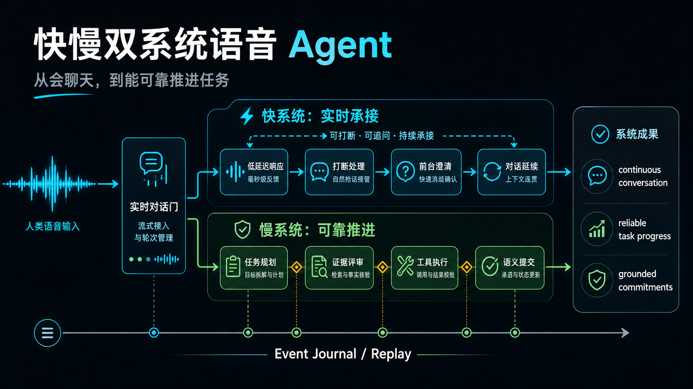
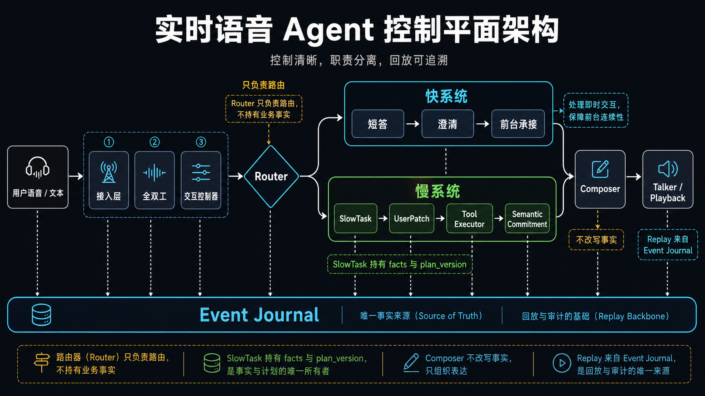
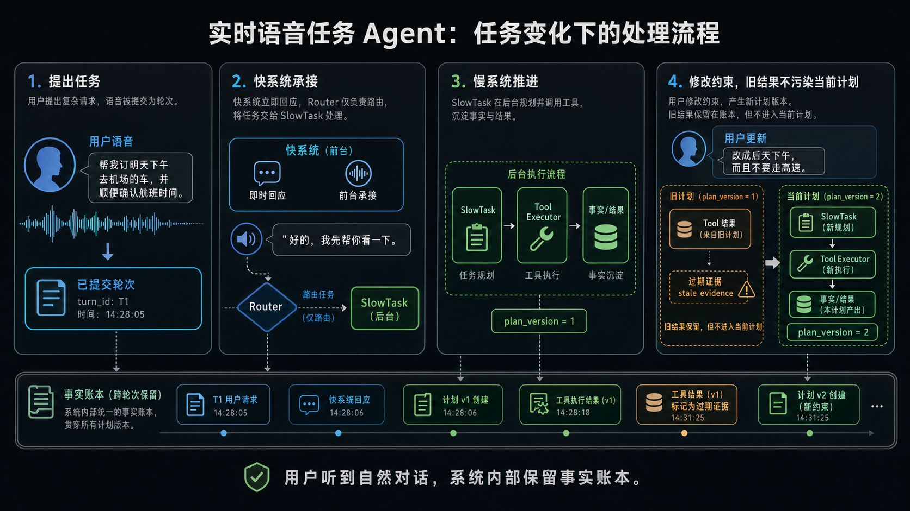
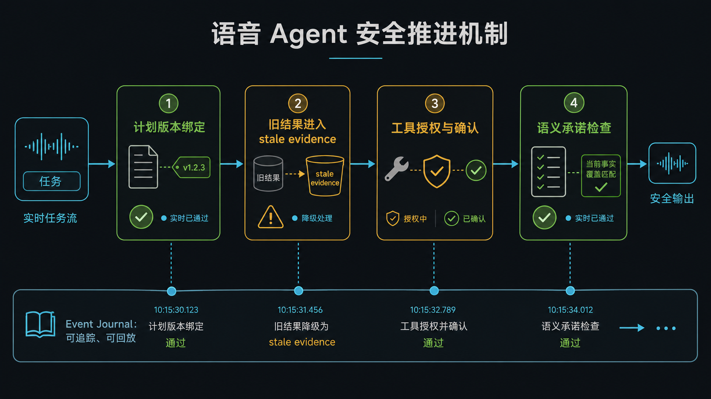

# Voice Agent

> 从实时语音对话，到实时任务副驾驶。

`voice-agent` 面向的是下一代实时语音 Agent：它不只是等用户说完、转文字、调用模型、再把答案读出来；它要在用户说话时保持在线，在前台接住对话，在后台推进复杂任务，并且只对系统能够证明的事实和动作做承诺。

**快系统让用户不等，慢系统让任务不错，全双工让交互不断，工具执行让事情办成。**

> 快速了解项目理念，建议先看：[快慢双系统语音 Agent 展示文档](docs/presentation.md)。



## 核心愿景

传统语音助手常被组织成一条串行链路：

```text
语音 -> ASR -> LLM -> TTS
```

这条链路可以回答短问题，但很难处理真实语音交互里的复杂情况：

- 用户会在助手说话时插话打断。
- 用户会在任务执行中继续补充约束。
- 快速回应很自然，但复杂任务需要慢思考。
- 工具结果回来时，任务计划可能已经变化。
- 高风险动作需要预览、确认和授权。
- 长任务需要真实进度，而不是乐观话术。

`voice-agent` 的目标架构把语音交互看成一个 **实时任务闭环**：

```text
Duplex 实时控制
  -> 快系统前台理解
  -> Router 分流
  -> 慢系统任务推理与工具执行
  -> 承诺控制
  -> Talker / Playback 表达
```

最终目标是：用户感受到的是自然、不断线的语音伙伴；系统内部运行的是可追踪、可确认、可回放的任务控制面。

## 为什么不一样



### 1. 实时自然

语音助手不应该像对讲机。真实对话里有重叠、修正、停顿、插话和短确认。Duplex 与 Interaction Controller 的边界，让系统可以在完整语义推理完成前处理语音时序：什么时候打开 turn、什么时候接受输入、什么时候截断正在播放的语音。

### 2. 快慢协同

快系统负责让用户不等待：短反馈、轻回答、澄清、前台陪伴和中间态承接。慢系统负责不能抢跑的部分：多步规划、证据审查、工具调用、RAG、记忆和最终语义承诺。

快慢之分不是“小模型 vs 大模型”，而是不同的时延预算、任务复杂度和事实责任。

### 3. 持续任务状态

复杂语音任务通常不是一次说完整的。用户可能会说：

> “帮我找个公司附近的地方……别太贵……时间改到 6 点以后。”

Agent 不能把这些当成互不相关的话轮。它需要持续的任务状态、用户补充、计划版本、旧结果处理和可回放证据。这就是架构里存在 SlowTask、UserPatch、`plan_version` 和 `task_event_seq` 的原因。

### 4. 可信执行

系统不应该让流利的声音掩盖不确定性。任务需要确认时，Agent 就要确认；工具结果属于旧计划时，它只能成为 stale evidence；Composer 负责把事实说得自然，但不能改写 SlowTask 拥有的事实；进度反馈必须来自真实状态，而不是编出来的安抚。

用户听到的是顺畅表达，系统内部保留的是事实账本。

### 5. 可回放工程

实时语音系统最难调试的地方，是时序、模型输出、工具输出和用户打断会同时发生。`voice-agent` 把 Event Journal 作为事实来源：关键状态迁移以 canonical event 记录，deterministic replay 只根据 recorded events 重建状态，不重跑模型、工具、网络、时钟或随机数。

## 最终体验会是什么样



### 打断也能接续

助手正在说话，用户突然打断：

> “不对，改成明天上午。”

目标体验是：播放快速截断，新语音被接受成一个 turn，当前任务收到修正，助手从更新后的任务状态继续，而不是从头再来。

### 边聊边做

用户提出复杂请求后继续补充细节。Agent 可以先用快系统回应，让对话不断线；同时慢系统在后台规划、查证、调用 sandbox 工具、更新任务。用户感知到的是持续推进，而不是长时间沉默。

### 高风险先确认

当动作有风险时，助手不应该用自信语气直接执行。它先生成预览，解释影响，等待用户确认，再通过授权边界执行。MVP 范围内，真实外部破坏性动作仍然阻断；demo 动作只在 sandbox 中运行。

## 架构愿景



这套架构的核心是职责所有权。

| 层次 | 拥有什么 | 为什么重要 |
| --- | --- | --- |
| Access Layer | 文本/音频入口和 span metadata | 输入先变得可追踪，再进入语义链路。 |
| Duplex | speech、directedness、barge-in、playback overlap candidates | 系统能在完整语义推理完成前做实时反应。 |
| Interaction Controller | deterministic turn ingress 和 playback interrupt policy | 只有被 commit 的 turn 才能进入理解和路由。 |
| Fast Thinker | 前台理解、短答、hint、中间态表达 | 用户能立刻感觉被接住。 |
| Router | FAST_ONLY / SPAWN_SLOW_TASK / PATCH_ACTIVE_SLOW_TASK / IGNORE | 快慢路径显式分流，不靠模型文本隐式决定。 |
| SlowTask | 任务事实、计划版本、证据审查、确认状态、语义承诺 | 复杂任务有唯一事实负责人。 |
| Tool Executor | manifest 校验、授权、sandbox 执行、UI patch events | 工具通过策略执行，而不是被模型文本直接驱动。 |
| Composer | 把事实和进度变成可说出口的话 | 表达可以自然，但事实不能被改写。 |
| Event Journal | append-only 的关键状态迁移 | replay、audit、latency 和 safety 共用同一条时间线。 |

## 核心亮点

### 实时 Turn 控制

文本输入可以绕过 Duplex，但不能绕过 Interaction Controller。音频输入可以先产生 speech / barge-in candidates，但 ASR、Thinker 和 Router 的语义链路只能在 `TURN_INGRESS_COMMITTED` 后推进。

这让实时交互控制和语义任务推理保持清晰分层。

### 前台快系统，后台慢系统

快系统负责让对话活着，慢系统负责高后果推理和最终任务事实。这样可以避免语音 Agent 常见失败：说得很快、听起来很确定，但其实系统还没有完成必要的查证和执行。

### 用 UserPatch 承接补充，而不是猜

当用户在活跃任务中补充信息时，系统会把它记录为 SlowTask 的 evidence，而不是让 Router 直接改写目标、约束或槽位。慢系统再判断这个补充是否实质改变任务、是否推进 `plan_version`、是否需要澄清。

### 承诺治理

最终回答不只是自然语言句子，而是由复杂任务 owner 发出的 `SemanticCommitment`。Composer 可以让它更像人说的话，但不能改变 immutable facts、resolved arguments、tool status、risk warnings 或 confirmation state。

### 有边界的工具执行

MVP 工具只运行在 demo sandbox 中。真实外部写操作、支付、预订、删除和外部通信都不在 MVP 范围内，必须通过未来 ADR 才能进入。一个有用的语音 Agent 应该能办事，但办事必须经过授权、审计和可回放的事件边界。

## 工程脊柱

这个仓库不只是概念稿，它已经包含通往最终形态的 control-plane spine。

| 脊柱 | 仓库中对应内容 |
| --- | --- |
| ADR 治理 | `docs/adr/` 下的 accepted ADR，以及 `stage_b_adr_register.md`。 |
| 规范事件 | event envelope、registry、journal、reducer-backed replay specs。 |
| Adapter 边界 | ASR、Thinker、Slow LLM、TTS contracts、capability profiles 和 output-mode labels。 |
| SlowTask 模型 | plan versioning、stale evidence policy、UserPatch、confirmation/cancel paths。 |
| Demo 工具 | Tool Executor、demo backend sandbox、UI state patch replay、confirmation gates。 |
| Composer 检查 | Thinker-as-Composer、commitment coverage、progress truthfulness checks。 |
| 语音路径 | provider-free 与 opt-in local wav routing paths、fake transports、live-eval gates。 |
| 本地调试台 | MVP6 localhost debug console，用于单段音频草稿 inspection 和 metadata-only QA history。 |

这套实现故意严格：一个行为如果没有 journal、不能 replay、或者越过了模块所有权边界，就不算有效 slice。

## 通往目标形态的路线

| Slice | 在愿景中的作用 |
| --- | --- |
| MVP0 | 建立 live-loop skeleton：ingress、interrupt/truncate、mock understanding、playback、journal、replay。 |
| MVP1 | 加入 SlowTask、UserPatch、plan versioning、stale evidence 和 task-focus routing。 |
| MVP2 | 加入 demo Tool Executor、sandbox UI patch、confirmation gates、Composer 和 truthfulness checks。 |
| MVP3 | 把 mock 边界推进到 provider-free real-adapter contracts 和 capability profiles。 |
| MVP4 | 用 synthetic/local wav metadata 验证最小 voice-input E2E control-plane routing。 |
| MVP5 | 加入显式 opt-in local wav verification，通过 ASR/Thinker adapter boundaries 与 Router summaries。 |
| MVP6 | 提供本地开发调试台，用于观察 single-audio routing path。 |

目标形态仍然比当前 MVP 更大：实时麦克风流式、生产级 full-duplex、AEC、真实 TTS voice-out、真实 Slow LLM loop、生产隐私策略和外部副作用工具，都需要后续 ADR 和实现。

## 开发者入口

运行测试请使用仓库统一入口：

```bash
./scripts/test -q
```

启动本地调试台：

```bash
scripts/mvp6-debug-console
```

打开：

```text
http://127.0.0.1:8766
```

推荐阅读顺序：

1. `AGENTS.md`
2. `stage_b_adr_register.md`
3. `docs/architecture-book.md`
4. `docs/specs/event-registry.md`
5. `docs/specs/replay-spec.md`
6. `docs/implementation/mvp6-local-debug-console.md`

## 仓库安全规则

愿景能成立，是因为安全边界必须成为真实工程边界。

- 外部模型调用必须走 adapter。
- 关键状态迁移必须写入 per-session Event Journal。
- task-relevant 的 ToolCall、ToolResult、UserPatch、SemanticCommitment 必须绑定 `task_id`、`plan_version`、`task_event_seq`。
- 旧计划的工具结果不得推进当前任务，除非 SlowTask 显式 adopt/rebase。
- MVP 工具只能运行在 demo sandbox。
- Composer 不得改写 SlowTask facts。
- Replay 不得重跑真实模型、工具、网络、时钟、随机数或读取缺失 refs。
- raw audio、raw debug trace、secret、local replay cache、unredacted real user input、provider body 不得提交。

## 一句话总结

`voice-agent` 正在构建一个实时语音 Agent 的控制面：它能保持对话不断线，在必要时慢思考，通过受控工具办事，并在事后解释自己的状态和决策。
