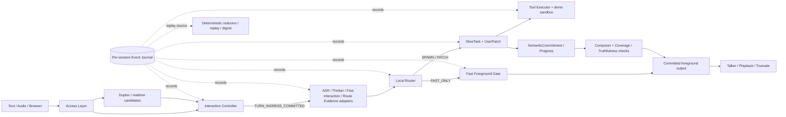

# Voice Agent 项目研发交接

> 现场快照：2026-08-03（Asia/Shanghai）
> 面向对象：第一次接触仓库、准备继续研发或接管交付的工程师
> 说明：本文是 implementation-facing 导航与现场记录，不替代 `AGENTS.md` 或 accepted ADR。发生冲突时，以 `AGENTS.md`、`stage_b_adr_register.md` 和对应 ADR 正文为准。

## 1. 五分钟结论

`voice-agent` 不是一个已经产品化的语音助手服务，而是一套围绕“快系统实时承接、慢系统可靠办事”构建的实时语音 Agent 控制面、验证运行时和研究实验集合。

接手前先记住六件事：

1. **系统权威不在模型。** Interaction Controller 决定 turn ingress，Local Router 决定四路路由，SlowTask 持有复杂任务事实，Fast Foreground Gate 决定候选能否展示或播放。
2. **关键行为必须事件化。** 没有写入 per-session Event Journal、不能 deterministic replay 的关键状态迁移，不算完成。
3. **当前已提交、可依赖的 accepted 基线止于 ADR-017。** Dirty tree 中的 ADR-018 及 Slice 3B.1 design 自称已 accepted，但当前精确文本仍待用户明确确认；在确认并形成原子治理提交前，不能把它们当作已生效架构授权。
4. **现场已建立 recovery 分支并落下五个恢复提交，但主体工作仍未交付。** 当前分支是 `codex/adr-018-slice3b1-recovery`，没有配置 upstream；仍有 31 个 tracked modified 文件和 63 个实际 untracked 文件。不要先 pull、rebase、checkout、clean 或 reset，也不要未经确认直接设置 upstream 或 push。
5. **测试健康，但测试的是 dirty composite tree。** 最近一次完整统一入口得到 `3428 passed in 58.16s`；Cards 01～09 的合并聚焦集合得到 `1323 passed`。这不能证明远端或当前 `HEAD` 已包含并可复现 Slice 3B.1。
6. **下一步先收口治理和可复现提交，再做 Card 10/11。** P0 是让用户确认 ADR-018 当前精确文本；确认后原子提交治理包，再按依赖和证据拆分提交 Cards 01～09。只有这些前置完成后，才进入 Controller-owned ingress、scenario runner、安全结果 schema、CLI、最小 replay fixtures 和正式 acceptance；不要提前进入 3B.2、Page C 或启用 native PCM。

## 2. 当前现场快照

以下数据采集于五个 recovery 提交完成后；本文自身已包含在 untracked 统计中。

| 项目 | 当前值 |
| --- | --- |
| 仓库 | `/Users/a123/voice-agent` |
| 当前分支 | `codex/adr-018-slice3b1-recovery` |
| `HEAD` | `e856fedcc151` — `docs: record Qwen fast-slow experiment milestones` |
| 配置 upstream | 无 |
| 相对旧远端 `origin/codex/adr-017-fast-interaction-adapter` | ahead 23 / behind 0 |
| 相对 `origin/main` | origin/main-only 3 / HEAD-only 24 |
| merge base | `04f0f6e1760ebde1e1bc3003091858e3b0eb5a61` |
| staged | 0 |
| tracked modified | 31 个文件 |
| tracked diff | 7,497 additions / 189 deletions |
| untracked | `git status` 默认折叠为 38 个条目，展开为 63 个文件 |
| 完整测试（dirty composite tree） | `3428 passed in 58.16s` |
| Cards 01～09 合并聚焦测试（dirty composite tree） | `1323 passed` |
| `git diff --check` | clean |
| 默认 Python | `/Users/a123/anaconda3/bin/python`，Python 3.11.5 |
| pytest | 7.4.0 |
| 浏览器实验依赖 | 当前 Anaconda 环境有 `aiohttp 3.8.5` |
| CI / lockfile | 未发现远端 CI、依赖 lockfile、tox/nox 或 pre-commit |

### 2.1 已提交的 recovery 批次

当前 recovery 分支已经把五组可以独立保存的历史工作落成提交：

| Commit | 边界 |
| --- | --- |
| `616c5c9` | isolated Qwen audio realtime browser spike |
| `37736b1` | Fast Foreground authority、replay 与 Slice 3A.1.3/MVP6.3 回归基线 |
| `b79d1f1` | deterministic audio routing eval |
| `9e68a5b` | Qwen realtime fast/slow control experiment |
| `e856fed` | 上述 Qwen fast/slow experiment 的 milestone 文档 |

这些提交让实验、eval 和既有 Fast Foreground 基线进入 `HEAD`，但**不包含**待确认的 ADR-018 治理包，也不包含 Cards 01～09 的主体实现。

### 2.2 为什么仍不能把当前 `HEAD` 当 Slice 3B.1 实现真相

当前 dirty tree 混合了：

- 待用户确认的 ADR-018 及其对 ADR-001/002/003/009/011/012/013/015/017 的同步修改；
- Qwen Realtime provider-free 协议、Session Adapter、Candidate Quarantine；
- Route Evidence / Candidate Safety contracts 与 fake adapters；
- Slice 3B.1 context、orchestrator、Gate/release contract、state/replay；
- Cards 01～09 的 acceptance、design、plan、spec 和测试；
- README、vision assets 和本文等尚未归档的文档工作。

干净 checkout 到 `e856fed` 会保留 2.1 的五组恢复提交，但仍会缺少上述内容。`git diff` 也看不到 untracked 文件，现场盘点必须同时运行：

此外，`HEAD` 中已提交的 Task Card audit 会引用当前仍 untracked 的 master plan 和 Cards enforcement paths；因此 clean `HEAD` 不能被当作绿色 Slice 3B.1 package。小提交可先跑边界对应的 focused tests，package full-suite 绿色应在 Cards 01～09 完整集成后重新建立。

```bash
git status --short --branch
git diff --stat
git ls-files --others --exclude-standard
```

### 2.3 接手后的安全起手式

先做只读盘点，不改变 Git 状态：

```bash
git status --short --branch
git log --oneline --decorate -20
git diff --check
git diff --name-only
git ls-files --others --exclude-standard
```

在确认改动所有权、交付边界和保存方式前，不要运行：

- `git pull` / `git rebase`；
- `git checkout` / `git switch`；
- `git clean`；
- `git reset`；
- 未确认目标远端分支就执行 `git push --set-upstream`；
- 任何会覆盖或批量删除当前文件的命令。

## 3. 文档与架构的权威顺序

仓库内存在历史 closeout、过时 roadmap、proposal 和在研实现，阅读时必须按权威层级判断。

1. **仓库治理**

   - [`AGENTS.md`](../AGENTS.md)
   - [ADR Register](../stage_b_adr_register.md)

2. **已确认的 accepted architecture**

   - [`docs/adr/`](adr/)
   - 当前 `HEAD` 的 Register 登记 ADR-001～ADR-017 为 `accepted`。

3. **待用户确认的候选治理文本**

   - [ADR-018 dirty draft](<adr/ADR-018 Single-session Qwen Realtime Parallel Route Evidence and Slow-to-Fast Context Projection.md>)
   - [Slice 3B.1 design dirty draft](superpowers/specs/2026-07-26-qwen-slice3b1-protocol-faithful-fake-design.md)

   这两份 dirty 文本及 dirty Register 都写着 `accepted`，但当前精确文本尚未获得本轮用户明确确认。确认并提交之前，它们是待审治理材料，不是高于 ADR-017 的生效授权。

4. **ADR 派生规格**

   - [Event Registry](specs/event-registry.md)
   - [State Reducers](specs/state-reducers.md)
   - [Replay Spec](specs/replay-spec.md)
   - [Model Adapter Capabilities](specs/model-adapter-capabilities.md)
   - [Adapter Capability Profiles](specs/adapter-capability-profiles.md)

5. **实施计划与 Task Card 执行面**

   - [Slice 3B.1 historical master plan](superpowers/plans/2026-07-27-qwen-slice3b1-protocol-faithful-fake.md)
   - [Slice 3B.1 Task Card index](governance/codex-task-cards/slice3b1/index.md)
   - [Slice 3B.1 Work Package](governance/codex-task-cards/slice3b1/WP-S3B1-01.md)

   Task Card index / Work Package 已在 `HEAD`，但其 entry criteria 假设 ADR-018 已 accepted。当前应停在治理确认门前，不能仅因卡片已提交就开始扩大 Slice 3B.1 权限。

6. **验收与 closeout**

   - `docs/implementation/*closeout.md`
   - `docs/implementation/*acceptance.md`

   它们证明某个时间点、某个 slice 的行为与命令结果，不会创建新的架构权限。

7. **Proposal、研究计划和 experiment 文档**

   - `docs/adr/proposals/`
   - `docs/research/`
   - `docs/superpowers/plans/`
   - `experiments/*/README.md`

   这些只用于解释历史和研究证据，不能覆盖 accepted ADR。

## 4. 项目目标、范围和非目标

### 4.1 项目要解决什么

传统串行链路：

```text
Speech -> ASR -> LLM -> TTS
```

难以同时处理真实语音任务中的打断、追加约束、后台慢任务、工具延迟、计划变化和高风险确认。本项目把系统重构为两个责任域：

| 系统 | 目标 | 责任 |
| --- | --- | --- |
| 快系统 | 低延迟、不中断、前台持续承接 | speech/turn 事实、短答、澄清、轻理解、route evidence、候选回复 |
| 慢系统 | 高后果、可验证、可追踪 | 任务事实、规划、证据审查、工具、确认、SemanticCommitment |

“快慢”不是模型大小划分，而是时延预算、事实责任和系统权限的划分。

### 4.2 当前明确不是什么

当前仓库不应被描述为：

- 可直接上线的生产语音助手；
- 有 durable Event Journal 的服务；
- 有生产身份、权限、隐私和保留策略的系统；
- 可执行真实支付、预订、删除或外部通信的工具平台；
- 支持多个 active SlowTask、pause/resume 或跨会话长期记忆的系统；
- 已经完成真实 Qwen 单会话/native PCM qualification 的产品；
- 已经完成真实 TTS 用户播放闭环的 MVP4/5/6 主链。

## 5. 总体架构



### 5.1 组件权威表

| 组件 | 唯一或主要权威 | 禁止越界 |
| --- | --- | --- |
| Access Layer | 文本/音频 span 与输入事件 | 不 commit turn，不做语义路由 |
| Duplex / Realtime Gate | pre-ASR speech、directedness、semantic-close、barge-in 候选 | 不解释任务，不做最终 route/commitment |
| Interaction Controller | turn open/hold/reject/commit；playback epoch；truncate request | 不依赖模型做首次 ingress；不取消 SlowTask |
| Event Journal | per-session event order、`event_seq`、因果、replay source | 不是全局阻塞消息总线；当前也不是 durable store |
| Model adapters | 标准化证据、候选、能力和失败元数据 | 不拥有 RouterDecision、任务事实或 release |
| Local Router | `FAST_ONLY` / `SPAWN_SLOW_TASK` / `PATCH_ACTIVE_SLOW_TASK` / `IGNORE`；`TaskFocusState` | 不接受确认、不改 plan、不授权工具 |
| UserPatch Pipeline | 当前 task/plan 的 evidence pack | 不直接改 goal、slot、constraint |
| SlowTask | task lifecycle、`plan_version`、confirmation、stale evidence、resolved arguments、SemanticCommitment | 不拥有 ingress、Router focus 或直接工具执行 |
| Tool Executor | manifest、provenance、current-plan authorization、幂等、sandbox、UI patch、结果归一化 | 不直接 mutate SlowTask；MVP 不执行真实外部副作用 |
| Fast Foreground Gate | fast candidate 是否可见/可听的唯一 release authority | 不让模型、provider 或 UI 绕过 |
| Composer | 把已确认事实表达得自然 | 不改 immutable facts、风险、确认、工具状态 |
| Coverage / Truthfulness checks | 播放前事实覆盖与进度真实性 | 不创造事实 |
| Talker / Playback | 播放、offset、实际 truncate 和 delivery | 不解释任务或生成事实 |
| Context Assembler | 从本地权威状态构造 bounded immutable projection | provider conversation 不是权威 memory |
| Candidate Quarantine | 临时持有未授权 candidate text/PCM | Gate 前不可展示/播放；不得持久化 raw PCM |
| Replay | recorded-events-only 状态重建 | 不重跑模型、工具、网络、时钟、随机数 |

## 6. 关键运行链路

### 6.1 会话启动

入口是 `src/voice_agent/runtime/session.py`：

```text
validate runtime_config_ref
  -> validate adapter profile set
  -> create InMemoryEventJournal
  -> SESSION_STARTED
  -> ADAPTER_CAPABILITY_SNAPSHOT_RECORDED
```

`HEAD` 中的 `src/voice_agent/runtime/assembly.py` 只支持：

- `mvp0_mock`；
- `mvp3`。

Dirty tree 另行增加了 `slice3b1_mock`，它属于尚未提交的 Cards 01～09 前置实现。

它做 profile validation 和 capability snapshot，不实例化一个完整生产 runtime；不要把它当作完整 DI/composition root。

### 6.2 文本 turn

```text
TEXT_INPUT_RECEIVED
  -> InteractionController.commit_text_ingress(...)
  -> TURN_OPENED
  -> TURN_INGRESS_ACCEPTED
  -> TURN_INGRESS_COMMITTED
  -> understanding adapters
  -> Local Router
```

文本绕过 Duplex，但不能绕过 Interaction Controller。

### 6.3 音频 turn

经典 provider-free 路径：

```text
AUDIO_SPAN_STARTED
  -> SPEECH_START_DETECTED
  -> TURN_OPENED
  -> AUDIO_SPAN_ENDED
  -> SPEECH_END_DETECTED
  -> TURN_INGRESS_ACCEPTED
  -> TURN_INGRESS_COMMITTED
  -> ASR / Thinker / Fast Interaction evidence
  -> Local Router
```

下游 ASR、Thinker、Fast Interaction、Route Evidence 和 Router 必须绑定已 journaled 的 committed turn。

### 6.4 打断与 truncate

```text
speech overlaps active playback
  -> BARGE_IN_CANDIDATE
  -> Interaction Controller validates current playback
  -> playback_epoch advances
  -> INTERRUPT_CANDIDATE
  -> TTS_TRUNCATE_REQUESTED
  -> Talker performs stop
  -> TTS_TRUNCATED
  -> delivery disposition / replay state
```

候选 offset、请求 cutoff 和实际 stop offset 是不同事实，不能合并。Provider auto-cancel 与本地播放 truncate 也是两条独立异步链。

### 6.5 Router 与 TaskFocus

Local Router 只产生四种权威结果：

- `FAST_ONLY`；
- `SPAWN_SLOW_TASK`；
- `PATCH_ACTIVE_SLOW_TASK`；
- `IGNORE`。

有 active task 时，Router 先判断 `TaskFocus`，再决定是前台闲聊、当前任务 patch、新任务候选、控制/取消候选、歧义还是非助手输入。

ASR、Thinker、Fast Interaction、Qwen Route Evidence 都只是输入证据。Provider 提示不能直接成为 RouterDecision；当前 Route Evidence 分支还要求其结构化 hint 与本地 Router 推导一致，否则 fail closed。

### 6.6 快路径：ADR-017

ADR-017 的 atomic topology 允许一次 Fast Interaction adapter call 同时产生：

- `route_hint`；
- `route_prelude`；
- `foreground_act`；
- `reply_candidate` 或 buffered delta；
- `final_fast_evidence`。

事件链：

```text
FAST_INTERACTION_OUTPUT_EMITTED
  -> FOREGROUND_REPLY_CANDIDATE_EMITTED
  -> ROUTER_DECISION_EMITTED
  -> FOREGROUND_ACT_GATE_PASSED / FAILED
  -> FOREGROUND_OUTPUT_COMMITTED / DISCARDED
```

Gate 至少要求 `FAST_ONLY + ANSWER + LOW risk + valid schema + sufficient confidence`。有 active task 时还必须是 foreground chat。候选或 delta 在 Gate 通过前只能 buffer，不能进入 UI、Talker 或用户历史。

### 6.7 慢路径：SlowTask / UserPatch / Tool

Spawn 主链：

```text
SPAWN_SLOW_TASK
  -> SLOWTASK_CREATED
  -> planning / evidence review
  -> arguments resolved or clarification/confirmation
  -> optional Tool Executor
  -> SEMANTIC_COMMITMENT_EMITTED
  -> Composer
  -> Coverage / Truthfulness check
  -> playback
```

Patch 主链：

```text
PATCH_ACTIVE_SLOW_TASK
  -> USER_PATCH_RECEIVED
  -> SlowTask interprets evidence
  -> no-op or PLAN_VERSION_ADVANCED
  -> replanning
```

`ToolCall`、`ToolResult`、`UserPatch`、`SemanticCommitment` 必须绑定：

- `task_id`；
- `plan_version`；
- `task_event_seq`。

旧 `plan_version` 的 ToolResult 默认只能进入 `stale_evidence`。只有 SlowTask 显式 adopt/rebase 后才能复用；版本号巧合不能推进当前任务。

### 6.8 Composer 与事实

`SemanticCommitment` 是复杂任务的事实源。Composer 只负责 spoken realization、风格和人设融合，不得改：

- `immutable_facts`；
- `must_say_fields`；
- `resolved_arguments`；
- tool status；
- risk warnings；
- confirmation state。

Commitment 输出必须通过 `CommitmentCoverageCheck`，进度输出必须通过 `ProgressTruthfulnessCheck` 后才能播放。当前 Composer/checker 主要是 mock 和结构化 metadata 检查，不代表真实 Composer LLM 已上线。

## 7. 候选 ADR-018：单 Qwen 会话并行拓扑

以下内容准确概括当前 dirty ADR-018 文本，但该精确文本仍待用户明确确认。若获确认，ADR-018 将在 ADR-017 之外增加 `speculative_candidate_parallel_route`：

```text
one browser Connect
  -> one logical Qwen Realtime session
  -> at most one active physical transport generation
  -> one serialized sender + one receive Session Pump
       -> duplex projection
       -> ASR projection
       -> candidate text/PCM projection
       -> composer projection

provider may speculate before local commit
  -> CandidateQuarantine only

local commit + final ASR
  -> Route Evidence Adapter.classify_route(...)

complete candidate transcript
  -> Candidate Safety Adapter.classify_candidate_safety(...)

recorded evidence join
  -> Parallel Fast Interaction Orchestrator
  -> Local Router
  -> Fast Foreground Gate
  -> optional immutable ForegroundReleaseTokenV1
  -> Talker revalidates before first PCM byte
```

### 7.1 若治理文本获确认，必须保持的约束

- 一次 browser Connect 定义 session memory 生命周期；新 Connect 从空状态开始。
- 同一 generation 只有一个 serialized sender 和一个 receive Pump 可以碰 provider socket。
- Provider conversation 只是 cache/projection，不是 task、plan、confirmation、journal 或 memory 的权威源。
- Provider 可提前生成，但本地 commit 前只能进入 quarantine。
- Route Evidence 和 Candidate Safety 是两个独立 adapter 操作，都是非权威 evidence。
- 一期候选必须完整 terminal，最多 80 个 Unicode scalar、2,000 ms PCM；prefix 永不 eligible。
- **Gate 前绝无 audible PCM。**
- 在线低延迟路径不做逐 turn 独立 PCM back-transcription。
- Native PCM 必须先通过锁定语料 qualification；放开后只做 non-blocking shadow verification。
- SlowTask 内容只能通过 current-plan、sanitized `SlowToFastHandoffV1` 进入快表达。
- 每个 provisional assistant item 必须恰好得到 `FULL`、`TRUNCATED` 或 `NOT_STARTED`。
- 未听见的 suffix 不能进入 delivered history。
- Slice 3B 仍只有一个 active SlowTask，没有跨 Connect durable memory。

### 7.2 当前 dirty `src/` 中已经存在什么

本节列出的 Qwen / Slice 3B.1 文件尚未进入 `HEAD`；它们是 Cards 01～09 的在研实现，不是 clean checkout 可用入口。

- `src/voice_agent/adapters/qwen_realtime/protocol.py`：严格 provider event types 与安全投影。
- `transport.py`：Fake/Real 共用 Protocol；**当前没有 `src/` 内真实 WebSocket transport 实现**。
- `scripted_wire.py` / `scenarios.py`：provider-shaped、permit-driven deterministic Fake。
- `session_adapter.py`：握手、readiness、one sender、one Pump、ASR join、cancel/cleanup。
- `ephemeral_text_store.py`：bounded、wipeable、session-only text refs。
- `quarantine.py`：候选绑定、完整性、correlation、digest 和内存所有权。
- `profile.py`：Qwen session / ASR logical role profiles。
- `runtime/qwen_realtime_session.py`：唯一 provider generation allocator 和 replaceable transport lifecycle。
- `route_evidence_contract.py` / `route_evidence_fake.py`：route/candidate-safety schema 与 Fake。
- `runtime/slice3b1/context_projection.py`：本地权威状态到 bounded immutable projection。
- `runtime/slice3b1/orchestrator.py`：只 join 已记录证据，不拥有模型、Router、Gate 或 release。
- `runtime/slice3b1_release.py`：default fail-closed Gate 与 isolated contract-only release 验证。
- `state/qwen_parallel_state.py`：ADR-018 reducer state。
- `replay/runner.py`：ADR-018 event chain 和安全校验。

### 7.3 Dirty Slice 3B.1 默认 Gate 为什么总是失败

`slice3b1_mock` profile 明确：

- `output_mode=mock`；
- `provider_free_test_support=true`；
- `real_live_support=false`；
- `native_pcm_enabled=false`。

默认 runner 可达路径会记录：

```text
FOREGROUND_ACT_GATE_FAILED
  -> FOREGROUND_OUTPUT_DISCARDED
```

并返回 `release_token=None`。这是当前验收目标，不是 bug。

`slice3b1_release.py` 内有 private `mock_contract_only` path，用于测试完整 token compare、atomic journal 和 memory-only outbox。它不可被 runner/CLI/生产 Gate 调用，也不构成 PCM qualification 或 native release 证据。

## 8. 代码地图

| 路径 | 职责 | 接手时先看 |
| --- | --- | --- |
| `src/voice_agent/access/` | text/audio ingress events | `text_ingress.py`、`audio_ingress.py` |
| `src/voice_agent/duplex/` | mock realtime speech/barge-in candidates | `mock_duplex.py` |
| `src/voice_agent/interaction/` | turn ingress、epoch、truncate authority | `controller.py`、`policy.py` |
| `src/voice_agent/events/` | canonical registry、envelope、journal | `registry.py`、`envelope.py`、`journal.py` |
| `src/voice_agent/adapters/` | contracts、profiles、fake/live transports、runtime wrappers | `capabilities.py`、`profiles.py`、各 role 文件 |
| `src/voice_agent/router/` | Local Router 与 TaskFocus | `router.py` |
| `src/voice_agent/slowtask/` | mock task lifecycle、plan/stale/confirmation | `mock_runtime.py` |
| `src/voice_agent/user_patch/` | current-plan evidence pack | `evidence_pack.py` |
| `src/voice_agent/tools/` | manifest、policy、progressive Tool Executor | `manifest.py`、`executor.py` |
| `src/voice_agent/demo_backend/` | 无外部副作用的内存 sandbox | `in_memory.py` |
| `src/voice_agent/composer/` | SemanticCommitment/progress 到 SpokenPlan | `thinker_as_composer.py` |
| `src/voice_agent/checks/` | coverage / truthfulness mock gates | `mock_checkers.py` |
| `src/voice_agent/talker/` | mock playback 与 truncate | `mock_talker.py` |
| `src/voice_agent/state/` | domain reducers | `slowtask_state.py`、`tool_execution_state.py`、`qwen_parallel_state.py` |
| `src/voice_agent/replay/` | manifest、validation、reducers、digest、scenario assertions | `runner.py`、`state_digest.py`、`scenario_assertions.py` |
| `src/voice_agent/privacy/` | secret-like payload redaction/block | `redaction.py` |
| `src/voice_agent/runtime/` | MVP harness、Router/Gate glue、debug console、Qwen lifecycle | `session.py`、`assembly.py`、`mvp4_*`、`mvp5_*`、`mvp6_*` |
| `src/voice_agent/evals/` | provider-free routing corpus/eval tooling | `evals/routing/` |
| `src/voice_agent/governance/` | Codex context snapshot/audit；不可被 runtime import | `governance/codex_context/` |
| `tests/` | acceptance、contract、replay、runtime、experiments | 按同名 source 模块定位 |
| `tests/fixtures/replay/` | synthetic/redacted/minimal canonical fixtures | `mvp0`～`mvp5` |
| `evals/routing/` | synthetic draft corpus、rubric、reviews | `README.md`、`manifests/README.md` |
| `experiments/` | 隔离的浏览器/真实 provider 研究 | 各自 `README.md` |

### 8.1 当前没有统一生产 composition root

`runtime/session.py` 只创建 Journal 和 capability snapshot；`runtime/assembly.py` 只校验 profile。MVP4、MVP5、MVP6 和 Qwen 各有自己的 harness。当前没有一个常驻、durable、完整组合所有模块的生产服务入口。

### 8.2 维护热点

以下文件已成为高复杂度热点，修改前先跑局部与 overlap tests：

- `src/voice_agent/replay/runner.py`：约 9,189 行；
- `src/voice_agent/replay/scenario_assertions.py`：约 3,725 行；
- `src/voice_agent/state/qwen_parallel_state.py`：约 2,212 行；
- `src/voice_agent/runtime/slice3b1_release.py`：约 1,621 行；
- `src/voice_agent/slowtask/mock_runtime.py`：约 1,657 行；
- `experiments/qwen_realtime_fast_slow_web/session_coordinator.py`：实验性大型 monolith。

不要在完成当前 slice 的同时顺手做无边界的大重构。先以 Task Card 的 allowed write set 和验证命令为准。

## 9. Event Journal、状态与 Replay

### 9.1 Event envelope

每个 canonical event 至少携带：

- `event_name` / `event_id` / `event_seq`；
- `event_schema_version`；
- `session_id` / `conversation_id`；
- `source_module`；
- monotonic 与 wall-clock timestamp；
- `trace_redaction_level`；
- 可选 `caused_by_event_id` / `supersedes_event_id`；
- domain-specific fields。

当前 dirty registry 有 108 个 canonical event definition，其中候选 ADR-018 新增 9 个。相关 registry 修改尚未进入 `HEAD`，且必须等待 ADR-018 精确文本获得用户确认后才能作为正式 canonical registry 提交。

### 9.2 Journal 实现边界

当前只有 `InMemoryEventJournal`：

- 每 session 从 1 分配连续 `event_seq`；
- append 时验证 ID、因果、schema 和隐私；
- `append_atomic_batch` 先完整 stage/validate，再一次提交；
- `events()` 返回 deepcopy；
- adapter callback 通过独立锁边界序列化。

当前没有：

- durable database；
- 跨进程单 writer；
- crash recovery；
- session journal persistence；
- 生产 retention/compaction。

### 9.3 Reducer / Replay

Replay 从 canonical events 重建：

- Interaction；
- Playback；
- TaskFocus；
- SlowTask；
- Tool Execution；
- Demo UI；
- SpokenPlan / checks；
- Adapter health；
- Trace privacy；
- Qwen parallel / delivery。

Replay 禁止调用真实模型、工具、网络、时钟和随机数。State digest 必须由安全、确定、可 JSON 序列化的 reducer state 生成。

### 9.4 Fixture 规则

提交到 Git 的 replay fixture 必须：

- synthetic；
- redacted；
- minimal；
- 不包含 raw audio、raw provider payload、secret、真实用户全文或本地路径；
- manifest 明确 `GITHUB_ALLOWED` 和 replay properties。

本地 raw audio、trace、cache、QA history、approval packet 应留在 `.gitignore` 覆盖范围，并按敏感数据处理。

## 10. Adapter 开发模型

一个完整 adapter 通常分为：

```text
contract / normalized schema
  -> capability profile
  -> fake transport
  -> optional approved live transport
  -> runtime adapter / event harness
  -> replay-safe events and refs
```

每个 adapter 必须明确：

- `adapter_id` / `adapter_type` / provider / model alias；
- role contract 与 prompt profile；
- capability matrix；
- timeout/retry/error model；
- `output_mode=real|mock|fallback|degraded`；
- unsupported capabilities；
- safe config/ref；
- schema validation 与 failure events。

业务模块不得直接调用 provider endpoint。Provider-specific HTTP/WebSocket 只能位于 adapter transport 内部。

### 10.1 当前真实能力的安全定位

仓库包含 ASR、LALM Thinker、Fast Interaction 和 Qwen Slow LLM 的 live transport/eval 代码，但它们都是：

- 显式 opt-in；
- approval packet 约束；
- bounded provider calls / timeout；
- runtime env credential；
- metadata-only 或受控本地输出；
- 不属于默认自动测试前置条件。

Fake transport 验证的是边界和错误处理，不证明真实延迟、音质、取消语义或长期稳定性。

## 11. MVP 与当前成熟度

| 阶段 | 可以可信宣称 | 不能宣称 |
| --- | --- | --- |
| MVP-0 | provider-free live-loop skeleton、ingress、interrupt/truncate、journal/replay | 真实模型/生产音频 |
| MVP-1 | single active SlowTask mock、UserPatch、plan/stale/confirmation replay | 真实 SlowTask agent loop |
| MVP-2 | demo sandbox tools、UI patch、Composer/checks、deterministic acceptance | 真实外部副作用、生产 frontend |
| MVP-3 | provider-free adapter contract/profile/assembly/fallback proof | 真实 provider 已由该 closeout 完成 |
| MVP-4 | synthetic/local wav metadata 到 ASR/Thinker/Router/SlowTask/UserPatch 的 provider-free E2E | 真实 voice output；结果是 `voice_output=none` |
| MVP-5 | local wav opt-in、approval gate、real/fake evidence 与 Router harness | 默认真实 provider；真实 TTS |
| MVP6.1 | localhost debug console、fake default、local QA history | 生产 server/concurrency |
| MVP6.2 | 当前代码中有 provider-free Fast Foreground/Gate 实现与测试 | 设计文档 status 已同步；生产 fast voice |
| MVP6.3 | 当前分支提交中有 audio-native Fast Interaction、waterfall、debug integration | 完整 closeout、真实产品 SLO |
| Slice 3A.2.1 | dual-session、provider-audio-disabled recovery hotfix 与部分 live evidence | single-session/native PCM；live verdict 仍 NO_GO |
| Slice 3B.0 | ADR-018 候选治理文本、同步修改和一致性测试存在于 dirty tree | 已获当前精确文本的用户确认；已形成治理提交；runtime/real/native capability |
| Slice 3B.1 | Dirty tree 中有大量 Cards 01～09 源码与测试，合并聚焦集 `1323 passed` | 已提交/逐卡 verified；已完成 closeout；可运行 runner/CLI；native PCM |

## 12. Slice 3B.1 当前进度与明确缺口

### 12.1 治理授权、卡片状态与代码状态脱节

[Task Card index](governance/codex-task-cards/slice3b1/index.md) 仍把 11 张卡和 Work Package 全标为 `not-started`，并明确“文件存在不等于完成”。与此同时，当前 dirty tree 已有 Cards 01～09 的大量实现与测试。

更早形成的 ADR-018、Slice 3B.1 design、Work Package 和卡片文本都写着 `accepted` 或假设 ADR-018 已 accepted；但当前精确 ADR-018 文本仍待用户明确确认。文件里的自述不能替代本轮确认，也不能越过 ADR-first gate。

因此正确描述是：

> ADR-018 正在等待当前精确文本的用户确认；Cards 01～09 存在较完整的在研实现且合并聚焦测试全绿，但仍在 dirty tree，尚未完成按依赖拆分提交、逐卡 verify-first 证据、状态回填和正式 package acceptance。

### 12.2 本次已验证的底层范围

聚焦命令覆盖：

- ADR-018 event registry / conditional envelope / privacy；
- atomic Journal batch；
- Qwen protocol / transport contract / scripted wire；
- ephemeral text / Candidate Quarantine；
- capability profiles / assembly；
- Qwen session lifecycle；
- Route Evidence / Local Router；
- context projection / orchestrator；
- default Gate / release contract；
- Qwen parallel reducer / replay。

Cards 01～09 合并聚焦集合的最近结果：

```text
1323 passed
```

该结果证明当前 dirty composite tree 的对应集合没有观察到回归；它不等于每张卡已 `verified`，也不证明 clean `HEAD` 具备 Slice 3B.1。

### 12.3 Card 10 缺失

[TC-S3B1-10](governance/codex-task-cards/slice3b1/TC-S3B1-10-scenario-runner.md) 所需下列文件当前不存在：

- `src/voice_agent/runtime/slice3b1/__init__.py`；
- `contracts.py`；
- `scenarios.py`；
- `ingress.py`；
- `runner.py`；
- `tests/runtime/test_slice3b1_result_schema.py`；
- `tests/runtime/test_slice3b1_ingress.py`；
- `tests/runtime/test_slice3b1_runner.py`；
- `tests/acceptance/test_slice3b1_acceptance_scenarios.py`。

Interaction Controller 也还没有 Card 10 设计要求的 `resolve_audio_ingress(...) -> AudioIngressResolutionV1`。

Card 10 的目标是：

- Controller-owned ingress；
- deterministic scenario catalog；
- exactly-once consumption；
- stable `Slice3B1RunV1`；
- 唯一安全 public serializer；
- 两次运行结果一致；
- 每个 ingress 恰好一个 terminal；
- replay 成功；
- 无 release token、playback outbox、Talker 或 native-success claim。

### 12.4 Card 11 缺失

[TC-S3B1-11](governance/codex-task-cards/slice3b1/TC-S3B1-11-cli-and-acceptance.md) 所需下列产物当前不存在：

- `src/voice_agent/runtime/slice3b1/cli.py`；
- `scripts/qwen-slice3b1`；
- `tests/runtime/test_slice3b1_cli.py`；
- `tests/replay/test_slice3b1_fixture_safety.py`；
- `tests/fixtures/replay/mvp6/slice3b1/`；
- `docs/implementation/qwen-slice3b1-provider-free-acceptance.md`。

CLI 必须是纯 presentation wrapper，不能包含 provider URL、API key、live/native PCM enable flag、Router、Gate 或 replay 逻辑。默认结果仍应是 mock + Gate failed。

### 12.5 推荐推进顺序

1. 请用户明确确认或拒绝 ADR-018 当前精确文本；未确认时停在治理门前。
2. 若确认，原子提交 ADR-018、Register、受影响 ADR/spec、经确认的派生 design 和治理一致性测试；不要夹带 traceability matrix、README 或实现代码。
3. 单独保存 Slice 3B.1 historical master plan 的 provenance，再按 Task Card DAG 对 Cards 01～09 运行 verify-first、focused 和 overlap commands，并拆分为可审查提交。
4. 记录每张卡的真实结果；只有依赖、write set 和证据都满足时才把对应 card 标为 `verified`。
5. 在 01～09 形成可复现基线后，按 Card 10 allowed write set 实现 ingress、result、scenarios 和 runner。
6. 按 Card 11 实现 presentation CLI、两份最小 fixture 和 acceptance。
7. 运行 package-level safety scan、完整统一测试和独立 review。
8. 完成前不要开始 3B.2、Page C、真实 Qwen transport 或 native PCM。

## 13. 开发环境与依赖

### 13.1 仓库声明

`pyproject.toml` 只声明：

- Python `>=3.11`；
- dev dependency `pytest>=7.4,<10`；
- pytest `testpaths=["tests"]`；
- import path `src`、`tests`。

没有 lockfile，也没有完整 runtime dependency 清单。

### 13.2 统一测试入口

必须使用：

```bash
./scripts/test -q
```

需要指定解释器时：

```bash
VOICE_AGENT_PYTHON=/path/to/python ./scripts/test -q
```

`scripts/test` 的选择顺序：

1. `VOICE_AGENT_PYTHON`；
2. `.venv/bin/python`；
3. `/Users/a123/anaconda3/bin/python`；
4. `python3`。

脚本不会安装依赖，也不会联网。新机器缺 pytest/runtime dependency 时，应由 human 明确批准安装方案，不要让 slice 实现任务自行尝试多个联网路径。

### 13.3 跨机器注意点

- `scripts/test` 内含当前工作站的 Anaconda 绝对路径；其他机器应显式设置 `VOICE_AGENT_PYTHON`。
- `scripts/asr-live-eval`、`scripts/asr-runtime-smoke`、`scripts/asr-live-session-smoke` 直接使用 `python3`，与其他 wrapper 不一致。
- Browser/Qwen experiments 需要 `aiohttp`，但它没有进入正式 project dependency。
- Node 缺失时部分 browser harness 会 skip。
- 本地 loopback bind 被沙箱禁止时，server tests 可能失败或 skip；需在允许 localhost 的环境单独复核。

## 14. 测试与验证命令

### 14.1 建议矩阵

| 目的 | 命令 |
| --- | --- |
| 完整回归 | `./scripts/test -q` |
| Acceptance | `./scripts/test tests/acceptance -q` |
| Event / Replay / State | `./scripts/test tests/events tests/replay tests/state -q` |
| Adapters | `./scripts/test tests/adapters -q` |
| Interaction / Router | `./scripts/test tests/interaction tests/router -q` |
| Runtime | `./scripts/test tests/runtime -q` |
| Routing eval tests | `./scripts/test tests/evals/routing -q` |
| Browser/Qwen experiments | `./scripts/test tests/experiments -q` |
| Qwen session package | `./scripts/test tests/adapters/qwen_realtime tests/runtime/test_qwen_realtime_session.py -q` |

### 14.2 当前证据

本次在当前 dirty tree 执行：

```bash
VOICE_AGENT_PYTHON=/Users/a123/anaconda3/bin/python ./scripts/test -q
```

结果：

```text
3428 passed in 58.16s
```

这个结果：

- 证明当前 composite tree 在本机当前环境下没有观察到测试回归；
- 不证明 `HEAD` 或远端可复现；
- 不证明真实 provider、真实音质、真实延迟或 production readiness。

## 15. 可运行入口

### 15.1 最稳妥的 provider-free smoke

```bash
./scripts/mvp4-voice-e2e-smoke --route provider-free
./scripts/mvp4-voice-e2e-smoke --route fast
./scripts/mvp4-voice-e2e-smoke --route spawn
./scripts/mvp4-voice-e2e-smoke --route patch
```

本次四条命令均返回 `status=passed`、`provider_call_used=false`、`real_tts_used=false`、`voice_output=none`。

### 15.2 Routing eval

```bash
./scripts/routing-eval audit
./scripts/routing-eval review
./scripts/routing-eval router --oracle-policy
./scripts/routing-eval e2e --oracle-policy
```

本次 audit 通过 80 个 synthetic draft case。`--oracle-policy` 只验证 deterministic policy wiring，不是模型准确率评估。当前 corpus 全部仍是 `annotation_status=draft`，不能作为 release gate 或 human-agreed ground truth。

### 15.3 MVP6 localhost debug console

默认 fake：

```bash
./scripts/mvp6-debug-console \
  --host 127.0.0.1 \
  --port 8766 \
  --output-root outputs/mvp6-debug-console
```

打开 `http://127.0.0.1:8766`。

它是 `ThreadingHTTPServer` + 本地文件 history 的开发工具，不是生产 server，也不应成为关键状态机并发模型。

### 15.4 Qwen audio browser spike

Provider-free fake：

```bash
/Users/a123/anaconda3/bin/python \
  experiments/qwen_audio_realtime_web/server.py \
  --provider fake \
  --host 127.0.0.1 \
  --port 8765
```

这个 spike 验证 browser AudioWorklet、PCM/WebSocket、provider protocol、backpressure 和播放。它明确不集成 Interaction Controller、Local Router、SlowTask、Tool Executor 或 canonical Event Journal，不能作为主 runtime 架构证据。

### 15.5 Qwen fast/slow browser experiment

Fake enforced 示例：

```bash
/Users/a123/anaconda3/bin/python \
  experiments/qwen_realtime_fast_slow_web/server.py \
  --provider fake \
  --routing enforced \
  --slow-runtime mock \
  --audio-output fake_pcm \
  --shadow-control dual_session \
  --host 127.0.0.1 \
  --port 8767
```

它是 Slice 1/2/3A 历史实验，主要是 dual-session topology；不要把它当作 ADR-018 single-session `src/` runtime。

### 15.6 当前还没有 Slice 3B.1 主运行入口

Cards 01～09 目前主要通过各 Task Card 的 focused / overlap tests 进入；`scripts/qwen-slice3b1`、`runtime/slice3b1/runner.py` 和稳定的 `Slice3B1RunV1` 尚不存在。接手时应从以下入口恢复上下文：

- `docs/governance/codex-task-cards/slice3b1/index.md`：依赖 DAG 与状态；
- `docs/governance/codex-task-cards/slice3b1/WP-S3B1-01.md`：package gate；
- `docs/superpowers/plans/2026-07-27-qwen-slice3b1-protocol-faithful-fake.md`：untracked historical provenance；
- `tests/qwen_slice3b1_support.py` 与对应 `tests/adapters|events|interaction|router|runtime|replay|state` 文件：当前 dirty test surface。

不要为了得到一个可演示命令而提前造临时 runner；正式主入口属于 Card 10/11。

## 16. 真实 provider / 麦克风测试边界

不要把真实 provider 测试当作普通 smoke。执行前必须同时满足：

- human 明确批准；
- 使用 adapter，而不是业务代码直连；
- 有结构化 approval packet；
- bounded call budget / timeout；
- credential 只在 runtime env；
- 输入是明确允许的 synthetic/local material；
- 输出目录已 ignore；
- metadata/redaction policy 已确认；
- 不把 raw audio、provider payload、prompt、secret 或真实用户全文提交。

常见 runtime env：

- `DASHSCOPE_API_KEY`；
- Qwen Realtime spike 的 `QWEN_REALTIME_WORKSPACE_ID`；
- 可选 `QWEN_REALTIME_VOICE`。

具体入口与 approval 形状：

- ASR：`docs/implementation/asr-*-closeout.md`；
- LALM Thinker：`docs/implementation/lalm-thinker-*.md`；
- Qwen Slow LLM：`docs/implementation/qwen-slow-llm-live-provider-*.md`；
- MVP5：`docs/implementation/mvp5-closeout.md`；
- MVP6.3：`docs/implementation/mvp6.3-live-fast-interaction-manual-debug.md`；
- Qwen Realtime experiment：`experiments/*/README.md`。

特别注意：`lalm-thinker-real-runtime-smoke` 和 `lalm-thinker-audio-native-smoke` 当前没有真正的 argparse `--help` gate；不要用 `--help` 探测它们，它可能进入实际 smoke 的 fail-closed 流程。

## 17. 常见问题定位

| 现象 | 首先检查 | 正确处理 |
| --- | --- | --- |
| 没有 pytest | `./scripts/test` 的解释器选择输出 | 设置 `VOICE_AGENT_PYTHON`；不要绕过入口或自动联网 |
| ASR/Thinker 有输出但 Router 没走 | 是否存在 matching `TURN_INGRESS_COMMITTED`；turn/utterance/ref 是否一致 | 修正因果绑定，不绕过 Controller |
| Route Evidence 与 Router 不一致 | current `TaskFocusSnapshot`、evidence schema、local inference | Route Evidence 不是 authority；fail closed 是正确行为 |
| Fast candidate 不显示 | candidate provenance、risk/schema/confidence、active task focus、Gate terminal | 不直接展示 provider candidate；查看 Gate failure code |
| Slice 3B.1 总是 discard | `slice3b1_mock` profile 和 `native_pcm_capability_check` | 这是默认验收目标；不要接 private contract-only pass path |
| Provider context 非 CLEAN | generation、epoch、cleanup/rebuild events | drop/count 新 PCM；不 buffer、不 replay |
| ToolResult 没推进任务 | `task_id` / `plan_version` / `task_event_seq` | 旧结果应 stale；显式 adopt/rebase 才可用 |
| Confirmation 没生效 | 是否走 ingress -> Router -> UserPatch -> SlowTask | 不从 raw text 直接接受确认 |
| Replay 失败 | event order、causal ID、mode label、task seq、safe refs、fixture manifest | 修复 canonical evidence；不让 replay 重跑外部逻辑 |
| Local server test bind 失败 | 沙箱是否允许 localhost | 在获准的 loopback 环境专项复核，不改业务断言绕过 |
| QA/history 包含敏感文本 | output root、safe response validator、credential-like detection | 阻断或 redaction；清理 ignored local artifact |

## 18. 开发一个变更的标准流程

### 18.1 通用流程

1. 明确变更属于哪个现有责任边界。
2. 查 ADR Register，阅读对应 accepted ADR。
3. 判断是否新增架构能力、事件名、权限或 MVP scope；如果是，先走 ADR。
4. 记录当前 dirty worktree 和 allowed write set。
5. 先写 focused RED test 或 replay/eval case。
6. 实现最小变更；外部模型只通过 adapter，工具只通过 Tool Executor。
7. 让关键状态写入 Event Journal，并补 reducer/replay。
8. 运行 focused tests。
9. 运行 overlap tests。
10. 运行 `./scripts/test -q`。
11. 运行 `git diff --check` 和 artifact/secret 安全扫描。
12. 更新 task card / acceptance evidence；只声明实际验证过的 mode。

### 18.2 新增 canonical event

必须按顺序：

```text
accepted ADR-002 update
  -> docs/specs/event-registry.md
  -> src/voice_agent/events/registry.py
  -> envelope conditions
  -> reducer/state digest
  -> replay validation
  -> synthetic fixture/eval
```

不能先在 Python 中“临时造一个事件名”。

### 18.3 新增或替换 adapter

至少覆盖：

- role contract；
- normalized output schema；
- profile/capability matrix；
- provider-free fake；
- validation/failure/degradation events；
- runtime wrapper；
- credential-safe refs；
- replay 不重跑 provider；
- real/mock/fallback/degraded 区分。

### 18.4 修改 SlowTask / Tool

检查：

- current task/plan/event seq；
- stale result policy；
- confirmation scope；
- current-plan authorization；
- idempotency；
- demo sandbox boundary；
- SemanticCommitment / progress provenance。

### 18.5 修改前台候选或播放

检查：

- committed turn；
- candidate provenance；
- Router authority；
- Gate-before-visible/audible；
- playback epoch；
- truncate；
- delivery disposition；
- undelivered suffix 是否被排除。

## 19. 文档漂移与阅读陷阱

以下文档有价值，但不是当前完整状态：

1. `docs/architecture-book.md` 是 frozen v0.4，只汇编 ADR-001～016 / MVP-0～3；ADR-017/018 必须另读。
2. `docs/project-overview.md` 与 `docs/planning/execution-roadmap.md` 仍停在较早阶段。
3. `docs/adr-traceability-matrix.md` 的 dirty 修改仍未完整覆盖 ADR-017/018，且“当前实现观察”仍是早期状态；不要把它夹进 ADR-018 治理提交。
4. `docs/specs/state-reducers.md` 和 `docs/specs/replay-spec.md` 没有完整同步 ADR-017/018，尽管 Python reducer/replay 已有大量实现。
5. `docs/implementation/mvp6.2-fast-foreground-design.md` 和 `mvp6.3-live-fast-interaction-design.md` header 仍写 `Design document only`，但当前分支 history/代码已有实现。
6. Slice 3B.1 Task Card index 全是 `not-started`，但 dirty tree 已有 Cards 01～09 的大量实现和绿色合并聚焦测试。
7. Dirty ADR-018、Slice 3B.1 design 和 Work Package 自述 `accepted`，但当前精确文本仍待用户明确确认；自述状态不能替代治理授权。
8. 旧 Qwen proposal 与 Slice 1/2/3A experiment 文档是历史拓扑；它们不能覆盖 ADR-017，也不能替代对 ADR-018 当前文本的确认。

接手后应把“文档状态同步”作为一个独立治理任务，但不要在未验证 Cards 01～11 前通过改文字提前宣布完成。

## 20. 风险与技术债优先级

### P0：先保护和形成可复现研发基线

- Recovery 分支及五个恢复提交已建立，但当前分支没有 upstream；
- ADR-018 当前精确文本尚未获得用户明确确认，不能提交为 accepted 或授权 Cards；
- Cards 01～09、相关治理同步和 31 modified / 63 untracked 文件仍未完整提交；
- 远端与 clean `HEAD` 仍无法复现 Slice 3B.1 的 `1323 passed` 或完整 dirty-tree 结果；
- 提交前仍需按治理、Card DAG、文档/vision 等边界确认所有权和原子分组。

### P1：完成 Slice 3B.1 验收闭环

- ADR-018 获确认后先提交原子治理包；
- 按依赖拆分提交并逐卡验证 01～09；
- Card 10 runner/ingress/result；
- Card 11 CLI/fixtures/acceptance；
- package safety audit 与 full regression。

### P1：规格同步

- traceability 补 ADR-017；
- reducer/replay spec 补 ADR-017/018；
- MVP6.2/6.3 状态与真实 evidence 对齐；
- 将 historical proposal/experiment 标识得更清楚。

### P1：真实能力仍未闭环

- `src/` 无真实 Qwen single-session WebSocket transport；
- native PCM 未 qualification，默认必须 disabled；
- Slice 3A.2.1 live verdict 仍 NO_GO；
- Qwen Slow LLM 尚未接入业务 SlowTask loop；
- MVP5 closeout 未把真实 wav smoke 作为完成证据；
- 无生产 TTS/playback、auth/privacy/persistence。

### P2：工程化

- 无 CI；
- 无 lockfile；
- runtime dependency 未正式声明；
- wrapper 的 Python 选择不一致；
- 本地 debug server 不是生产并发模型；
- Event Journal 只在内存；
- replay/state/experiment 存在大型 monolith。

### P2：Eval

- routing corpus 仍是 80 条 synthetic draft；
- 还未 human review / freeze；
- oracle wiring 不是模型评估；
- real-human / audio holdout 尚未形成 release gate。

## 21. 推荐的第一周接手计划

### 第 0 天：确认 recovery 现场

- 只读 inventory；
- 确认当前是 `codex/adr-018-slice3b1-recovery` / `e856fed`，且尚无 upstream；
- 阅读并核对五个 recovery commit 的边界；
- 与原开发者确认剩余 dirty 文件分组与所有权；
- 在允许 loopback 的环境重跑完整测试；
- 不 rebase、不清理、不直接 set-upstream/push。

### 第 1 天：关闭 ADR-018 治理门

- 阅读 `README.md`、`AGENTS.md`、Register；
- 读 ADR-001/002/003/006/016/017 和 dirty ADR-018；
- 请用户明确确认或拒绝 ADR-018 当前精确文本；
- 若确认，原子提交治理包并跑治理一致性测试；若未确认，不进入 Cards 01～11；
- 跑 MVP4 provider-free smoke，并选择一个 replay fixture 从 event 跟踪到 reducer/digest；
- 跑已提交的 routing audit，理解 oracle/non-model 边界。

### 第 2～3 天：Slice 3B.1 resume audit

- 在 ADR-018 治理提交后，按 Work Package 依赖顺序拆分提交并验证 Cards 01～09；
- 不以文件存在代替证据；
- 记录每张卡的 focused/overlap command、结果和 changed paths；
- 核对已确认 ADR 与 spec/code 是否一致。

### 第 3～4 天：Card 10

- 严格遵守 allowed write set；
- 实现 Controller-owned ingress；
- 建立 deterministic scenario catalog；
- 定义唯一 `Slice3B1RunV1.to_safe_dict()`；
- 验证 exactly-once、determinism、replay 和 no-release。

### 第 5 天：Card 11 与 package closeout

- presentation-only CLI；
- 两份 minimal canonical fixtures；
- fixture safety；
- acceptance evidence；
- full suite / security scan / independent review；
- 只在证据充分后更新 card status。

### 暂不做

- 3B.2 real transport；
- native PCM enablement；
- Page C；
- cross-session memory；
- multi active SlowTask；
- 真实外部 side-effect tools；
- 为了“让 Demo 能响”而绕过 Gate。

## 22. Code Review P0/P1 速查

发现以下任一情况应拒绝或阻断：

- 业务模块直接调用 provider；
- 关键状态没有 canonical event；
- 新事件名未先进入 accepted ADR-002；
- 绕过 Interaction Controller；
- Route Evidence 成为 Router authority；
- provider context 成为 memory authority；
- candidate 在 Gate 前显示或发声；
- raw/stale/untrusted SlowTask 材料进入 Qwen；
- old-plan ToolResult 直接推进 current plan；
- confirmation/tool authorization 被绕过；
- Composer 改写事实；
- 模型文本直接驱动 UI；
- MVP 工具产生真实外部副作用；
- reducer/replay 调用网络、模型、工具、时钟、随机数；
- async scheduling 或线程并发推进关键状态写入；
- raw audio、trace、secret、credential、真实用户文本进入 repo；
- native PCM 没有 promoted profile、精确 correlation/digest 和 current Gate token；
- undelivered assistant suffix 进入历史；
- Slice 3B 引入 durable cross-session memory。

## 23. 术语表

| 术语 | 含义 |
| --- | --- |
| Turn | 一次由 Interaction Controller 接受并 commit 的用户输入单元 |
| Utterance | turn 内的语音/表达关联标识 |
| Event Journal | per-session canonical fact log；当前实现为内存 |
| RouterDecision | 四路权威路由结果 |
| TaskFocus | 当前输入相对 active task 的语义归属 |
| SlowTask | complex task state owner |
| `plan_version` | 当前任务计划版本 |
| `task_event_seq` | 单 task 内的状态事件顺序 |
| UserPatch | 绑定 active task 的证据包，不是直接 mutation |
| SemanticCommitment | 慢系统最终事实承诺 |
| SpokenPlan | Composer 产生、等待 checks 的表达计划 |
| Fast Interaction | 低延迟 route evidence + foreground act + candidate role |
| Gate | fast candidate release authority |
| Candidate Quarantine | Gate 前的内存隔离区 |
| `provider_session_generation` | 物理 provider transport 重建 fence |
| `playback_epoch` | 本地播放/打断 generation fence |
| Output mode | `real` / `mock` / `fallback` / `degraded` |
| Route Evidence | 小模型给出的非权威结构化路由证据 |
| SlowToFastHandoff | current-plan、sanitized 的慢到快表达交接 |
| Delivery disposition | `FULL` / `TRUNCATED` / `NOT_STARTED` |

## 24. 推荐阅读顺序

### 第一次上手

1. [README](../README.md)
2. [AGENTS](../AGENTS.md)
3. [ADR Register](../stage_b_adr_register.md)
4. ADR-001、002、003
5. ADR-006、007、004、008、016
6. ADR-009、013
7. ADR-005、014
8. ADR-011、010、015、012
9. [ADR-017](<adr/ADR-017 Fast Interaction Adapter and Foreground Act Contract.md>)
10. [ADR-018 dirty draft（待读后由用户确认当前精确文本）](<adr/ADR-018 Single-session Qwen Realtime Parallel Route Evidence and Slow-to-Fast Context Projection.md>)

### 当前主线

1. [Slice 3B.1 dirty design（随 ADR-018 一并等待确认）](superpowers/specs/2026-07-26-qwen-slice3b1-protocol-faithful-fake-design.md)
2. [Task Card index](governance/codex-task-cards/slice3b1/index.md)
3. [Work Package](governance/codex-task-cards/slice3b1/WP-S3B1-01.md)
4. [Card 10](governance/codex-task-cards/slice3b1/TC-S3B1-10-scenario-runner.md)
5. [Card 11](governance/codex-task-cards/slice3b1/TC-S3B1-11-cli-and-acceptance.md)

### 历史验证

- `docs/implementation/mvp2-closeout.md`；
- `docs/implementation/mvp3-closeout.md`；
- `docs/implementation/mvp4-closeout.md`；
- `docs/implementation/mvp5-closeout.md`；
- `docs/implementation/mvp6-local-debug-console.md`；
- `docs/implementation/qwen-realtime-fast-slow-slice3a21-acceptance.md`。

`docs/implementation/qwen-single-session-slice3b0-governance-acceptance.md` 当前是 untracked dirty 文档；文件名里的 `acceptance` 不构成 ADR-018 已获本轮确认的证据。

## 25. 最终交接检查表

接手人开始编码前，应能回答：

- [ ] 当前分支和 dirty 文件是否已安全保全？
- [ ] 如果工作依赖 ADR-018，用户是否已明确确认当前精确文本，并且治理包是否已经原子提交？
- [ ] 我修改的能力由哪份 accepted ADR 授权？
- [ ] 哪个模块拥有最终权威？
- [ ] 是否需要新增 canonical event；如果需要，ADR-002 是否先更新？
- [ ] 是否有对应 reducer、replay 或 eval？
- [ ] 外部模型是否只在 adapter 中？
- [ ] task-bound 数据是否携带 task/plan/seq？
- [ ] candidate 是否在 Gate 前保持不可见/不可听？
- [ ] artifact 是否 synthetic/redacted/minimal？
- [ ] focused、overlap、full tests 是否都从 `./scripts/test` 运行？
- [ ] 我声明的 mode 是 real、mock、fallback 还是 degraded？
- [ ] 我是否把 provider-free evidence 误写成 real/live/production claim？

满足这些问题后，再开始当前 Card 的最小实现。
