# Architecture Diagrams / 架构图示

本文档是一份 diagram-as-code 辅助读本，用 Mermaid 汇总 `voice-agent` 的项目定位、架构边界、MVP-0 / MVP-1 / MVP-2 当前实现观察，以及 MVP-3 后续方向。

它不替代 ADR，也不修改 ADR。图中的 event name 使用 `docs/specs/event-registry.md` 的 canonical event names；RouterDecision、TaskFocus、SlowTask state 使用现有 spec / code 中的取值。

## 当前实现观察

- 当前仓库不是产品 demo、服务入口或前端 demo，而是 live voice agent 的 architecture baseline、Python control-plane 和 replayable mock spine。
- 当前源码、测试和 `tests/fixtures/replay/mvp2/manifest.index.json` 显示：MVP-0 walking skeleton、MVP-1 mock/replay spine 和 MVP-2 deterministic demo/replay acceptance 均已落地到当前工作区；`docs/project-overview.md` 与 `docs/planning/execution-roadmap.md` 应保持这一完成态描述。
- 已观察到的 MVP-1 范围包括 `MVP1Router`、`TaskFocusState`、`SlowTaskState`、`MockSlowTaskRuntime`、`UserPatchEvidencePackRuntime`、plan version advance、stale result policy、confirmation/cancel/switch-task fixtures、MVP-1 acceptance runner。
- 已观察到的 MVP-2 范围包括 `ToolExecutionState`、demo Tool Executor、demo backend state、`TOOL_UI_STATE_PATCHED` replay、demo destructive confirmation gates、webSearch evidence boundary、Thinker-as-Composer、coverage/truthfulness checks 和 MVP-2 acceptance runner。
- 未观察到 MVP-3 real adapter runtime：没有 real ASR/Thinker/Slow LLM/TTS adapter integration、真实 frontend demo、真实外部 side effects、adapter capability profiles 或 runtime assembly gate。

## 维护规则

- 如果新增 MVP-relevant event name，先更新 accepted ADR / event registry，再更新本文档。
- 如果实现状态变化，只更新每张图下的 “当前实现状态”，不要把目标架构误写成已实现行为。
- Mermaid 图可以使用模块名、状态值、决策值和说明文字；journal event name 必须保持 canonical。

## 1. 项目定位总览图

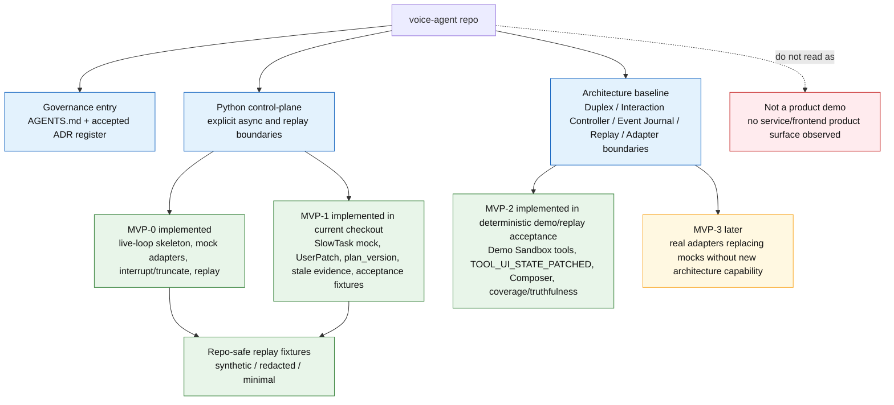

**这张图说明什么**

该仓库的核心价值是可回放、可治理的 live voice agent 架构骨架，不是一个可直接体验的产品 demo。当前工作区已经完成 MVP-0 walking skeleton、MVP-1 mock/replay spine 和 MVP-2 deterministic demo/replay acceptance，并在源码、fixtures 和 acceptance tests 中可观察。

**关键 ADR/Spec 来源**

`AGENTS.md`、`stage_b_adr_register.md`、ADR-001 / ADR-002 / ADR-003 / ADR-004 / ADR-006 / ADR-007 / ADR-010 / ADR-011 / ADR-012 / ADR-015 / ADR-016、`docs/specs/event-registry.md`、`docs/specs/replay-spec.md`。

**当前实现状态**

当前 checkout 观察到 MVP-0、MVP-1 和 MVP-2 deterministic demo/replay acceptance 已实现；MVP-3 real adapter runtime 未实现。

**禁止误读**

不要把 mock capability、synthetic fixture 或 acceptance replay 误读为真实模型、真实工具、真实前端或生产服务能力。

## 2. 目标系统主链路图

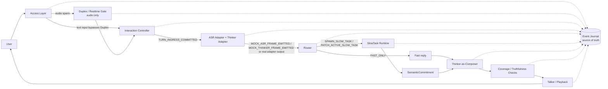

**这张图说明什么**

目标系统不是 `ASR -> LLM -> TTS` 级联，而是由 realtime ingress、deterministic turn commit、post-commit Router、SlowTask fact ownership、Composer fact boundary 和 replayable playback 组成的主链路。

**关键 ADR/Spec 来源**

ADR-001、ADR-002、ADR-003、ADR-006、ADR-008、ADR-009、ADR-011、ADR-013、ADR-016、`docs/architecture-book.md`。

**当前实现状态**

当前实现已覆盖 Access Layer、mock Duplex、Interaction Controller、mock ASR/Thinker、Router、mock Talker/Playback、Event Journal、deterministic replay、MVP-1 SlowTask/UserPatch mock/replay spine，以及 MVP-2 demo Tool Executor、demo backend state、UI patch replay、Composer 和 coverage/truthfulness checks acceptance。Real adapters、真实 frontend demo 和真实外部 side effects 未实现。

**禁止误读**

不要把 MVP-2 Composer/check acceptance 读成真实 provider-backed Composer 或 TTS playback 能力；当前路径仍是 mock/replay oriented。

## 3. 模块职责边界图

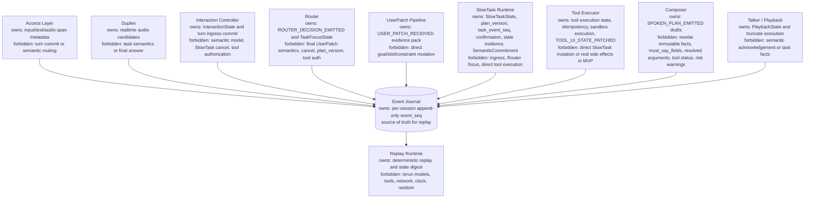

**这张图说明什么**

每个模块只拥有自己的 state 和 event emission boundary。系统可靠性来自 “关键状态必须进 Event Journal” 和 “Reducer 只消费 recorded events”，不是来自模块之间共享隐式内存。

**关键 ADR/Spec 来源**

ADR-001、ADR-002、ADR-004、ADR-005、ADR-006、ADR-007、ADR-009、ADR-010、ADR-013、ADR-016、`docs/specs/state-reducers.md`。

**当前实现状态**

当前实现已观察到 Access、Duplex mock、Interaction Controller、Router MVP-0/MVP-1、UserPatch Pipeline、SlowTask mock runtime/state reducer、Talker mock、Replay Runtime、MVP-2 Tool Executor/demo backend state、Composer/checkers 和 `TOOL_UI_STATE_PATCHED` replay acceptance。

**禁止误读**

Router 的 `PATCH_ACTIVE_SLOW_TASK` 只触发 UserPatch evidence flow，不代表 Router 可以解释最终 patch 语义、推进 `plan_version` 或取消任务。

## 4. Text Input 时序图

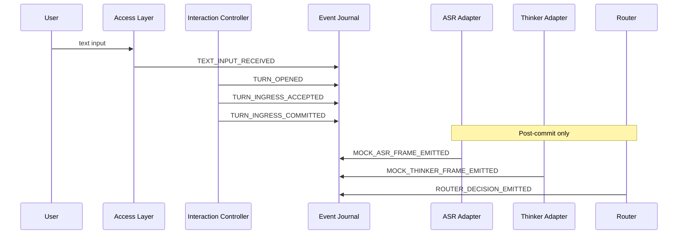

**这张图说明什么**

Text input 绕过 Duplex，但不能绕过 Interaction Controller。只有 `TURN_INGRESS_COMMITTED` 之后，ASR/Thinker mock frames 和 Router decision 才能出现。

**关键 ADR/Spec 来源**

ADR-001、ADR-002、ADR-011、ADR-012、`docs/specs/event-registry.md`、`docs/specs/state-reducers.md`。

**当前实现状态**

当前实现和 MVP-0/MVP-1 fixtures 都体现了 text path 的 post-commit ordering，Replay runner 也校验 `MOCK_ASR_FRAME_EMITTED`、`MOCK_THINKER_FRAME_EMITTED`、`ROUTER_DECISION_EMITTED` 必须在 matching `TURN_INGRESS_COMMITTED` 之后。

**禁止误读**

不要因为 text path “不经过 Duplex” 就认为 Access Layer 可以直接进入 Router；turn ingress commit 仍由 Interaction Controller 拥有。

## 5. Audio Input + Barge-in/Truncate 时序图

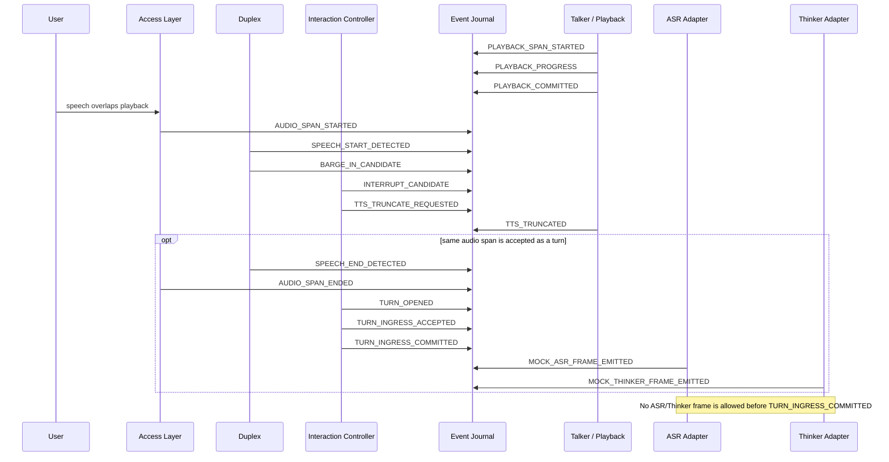

**这张图说明什么**

Barge-in/truncate 是 playback control path：Duplex emits candidate，Interaction Controller turns it into interrupt/truncate request，Talker records actual truncation。ASR/Thinker 仍然不能参与首次 ingress commit。

**关键 ADR/Spec 来源**

ADR-001、ADR-002、ADR-003、ADR-010、ADR-011、`docs/specs/replay-spec.md`。

**当前实现状态**

MVP-0 fixtures include the `BARGE_IN_CANDIDATE -> INTERRUPT_CANDIDATE -> TTS_TRUNCATE_REQUESTED -> TTS_TRUNCATED` chain and replay keeps playback offset, cutoff offset, and actual stop offset distinct.

**禁止误读**

`PLAYBACK_COMMITTED` 是 delivery marker，不是用户理解或确认；barge-in truncate 也不是 SlowTask cancel。

## 6. Router / TaskFocus 决策图

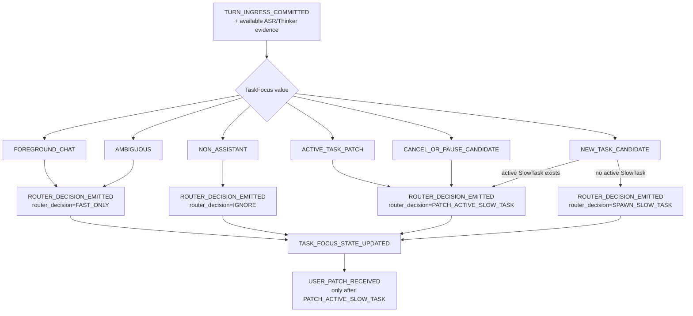

**这张图说明什么**

Router 是 post-commit gate。它只能在 canonical RouterDecision 集合中选择，并维护 TaskFocusState；active task 场景中，new task / cancel / pause candidates 先进入 UserPatch evidence 和 SlowTask-owned confirmation path。

**关键 ADR/Spec 来源**

ADR-006、ADR-007、ADR-008、ADR-016、`docs/specs/state-reducers.md`、`src/voice_agent/router/router.py`。

**当前实现状态**

当前代码包含 `MVP0Router` 和 `MVP1Router`。MVP-0 fixture 限制 `FAST_ONLY` / `IGNORE`；MVP-1 fixture/acceptance runner 覆盖 `FAST_ONLY`、`SPAWN_SLOW_TASK`、`PATCH_ACTIVE_SLOW_TASK`、`IGNORE` 和六个 TaskFocus values。

**禁止误读**

`NEW_TASK_CANDIDATE` 在已有 active SlowTask 时不是自动替换任务；它必须通过 `PATCH_ACTIVE_SLOW_TASK` 进入 SlowTask confirmation/cancel/switch flow。

## 7. SlowTask 状态机图

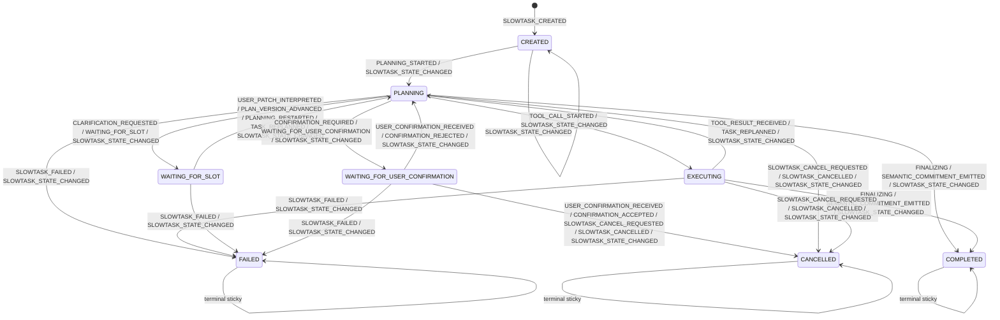

**这张图说明什么**

SlowTask owns lifecycle state and every state transition must be journaled with `SLOWTASK_STATE_CHANGED`。`COMPLETED`、`CANCELLED`、`FAILED` 是 terminal sticky states；late evidence can be diagnostic but cannot advance the task。

**关键 ADR/Spec 来源**

ADR-004、ADR-008、ADR-016、`docs/specs/state-reducers.md`、`docs/specs/mvp1-acceptance-scenarios.md`。

**当前实现状态**

当前 `SlowTaskState` reducer 包含这些 lifecycle states 和 terminal stickiness rules。MVP-1 fixtures cover completed、cancelled、failed、waiting-slot、plan advance、stale result、adoption、confirmation and switch-task branches。`EXECUTING` exists in state rules but real Tool Executor execution is not implemented in current checkout。

**禁止误读**

`TOOL_CALL_STARTED` / `TOOL_RESULT_RECEIVED` 在 MVP-1 中只用于 synthetic marker / stale policy validation；不要把它读成 MVP-2 progressive Tool Executor 已实现。

## 8. UserPatch Evidence Pack 图

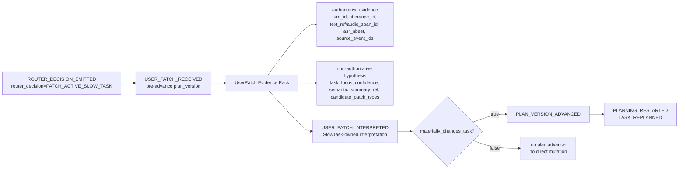

**这张图说明什么**

UserPatch 是 evidence pack，不是 task mutation。Router classification and Thinker hints can enter non-authoritative hypothesis, but SlowTask must interpret the patch before any material plan change。

**关键 ADR/Spec 来源**

ADR-004、ADR-006、ADR-007、ADR-008、ADR-016、`docs/specs/mvp1-acceptance-scenarios.md`、`src/voice_agent/user_patch/evidence_pack.py`。

**当前实现状态**

当前 `UserPatchEvidencePackRuntime` emits `USER_PATCH_RECEIVED` with authoritative/non-authoritative sections, and `MockSlowTaskRuntime.interpret_user_patch` emits `USER_PATCH_INTERPRETED` followed by optional `PLAN_VERSION_ADVANCED` / replanning events for material patches。

**禁止误读**

`USER_PATCH_RECEIVED` 不等于 slot update、goal rewrite、confirmation 或 cancel；这些只能在 SlowTask interpretation and current-plan binding 之后产生后续 canonical events。

## 9. Plan Version / Stale ToolResult 图

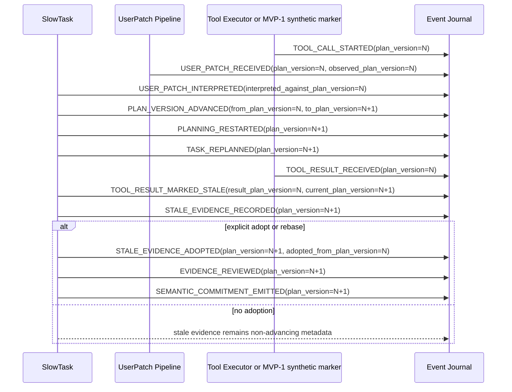

**这张图说明什么**

`plan_version` 是 stale policy 的核心隔离线。旧 plan 的 result 到达时，默认只能进入 stale evidence；只有 `STALE_EVIDENCE_ADOPTED` 之后才可进入 current-plan reasoning。

**关键 ADR/Spec 来源**

ADR-004、ADR-016、`docs/specs/replay-spec.md`、`docs/specs/mvp1-acceptance-scenarios.md`、`src/voice_agent/state/slowtask_state.py`。

**当前实现状态**

当前 MVP-1 fixtures include stale result without adoption and stale result with adoption. `SlowTaskState.validate_replay_complete()` rejects old-plan `TOOL_RESULT_RECEIVED` without stale mark/record chain, and downstream current-plan use of stale evidence requires adoption metadata。

**禁止误读**

`STALE_EVIDENCE_RECORDED` 本身不允许推进 current task；不要把 stale evidence storage 读成 accepted evidence。

## 10. Replay 机制图

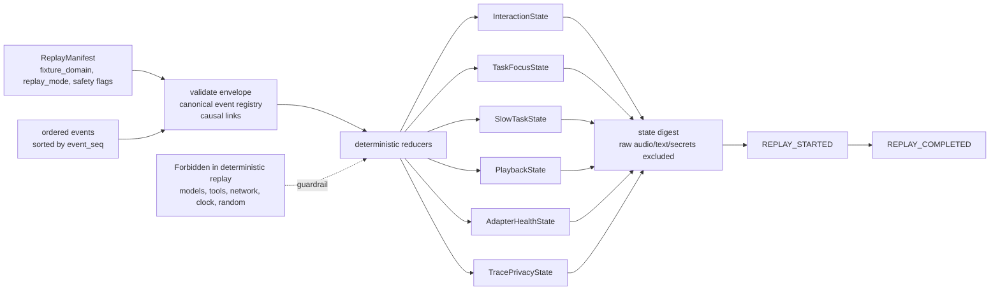

**这张图说明什么**

Replay uses recorded events and refs to rebuild state. It emits replay markers and a digest, but deterministic replay must not generate new model/tool outputs or depend on timing/randomness。

**关键 ADR/Spec 来源**

ADR-002、ADR-010、ADR-012、`docs/specs/replay-spec.md`、`docs/specs/state-reducers.md`。

**当前实现状态**

当前 `run_replay_fixture` validates manifests/events, reduces InteractionState、TaskFocusState、SlowTaskState、ToolExecutionState、DemoUIState、PlaybackState、AdapterHealthState、TracePrivacyState, builds `REPLAY_STARTED` / `REPLAY_COMPLETED`, and computes state digest. MVP-0、MVP-1 和 MVP-2 fixture manifests are GitHub-allowed deterministic fixtures。

**禁止误读**

Replay success is not evidence that real models/tools work. It proves control-plane state can be reconstructed from journaled facts。

## 11. MVP 路线图

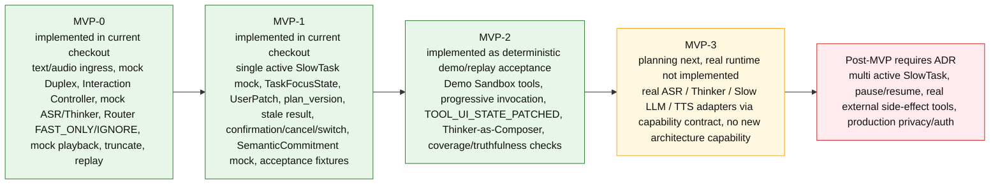

**这张图说明什么**

MVP progression is scope-gated. MVP-0 proves live-loop/replay skeleton; MVP-1 proves SlowTask/UserPatch/plan consistency; MVP-2 adds demo tools and Composer checks; MVP-3 only swaps real adapters into the existing architecture。

**关键 ADR/Spec 来源**

ADR-005、ADR-009、ADR-011、ADR-012、ADR-013、ADR-014、ADR-016、`docs/planning/execution-roadmap.md`、`docs/implementation/mvp0-backlog.md`、`docs/implementation/mvp1-backlog.md`。

**当前实现状态**

Current checkout shows MVP-0, MVP-1, and MVP-2 deterministic demo/replay acceptance implemented. MVP-3 is directionally specified but real adapter runtime is not implemented in the observed source tree。

**禁止误读**

MVP-3 is not permission to add new architecture capability; it is adapter replacement only. MVP-2 demo tools remain sandboxed and cannot perform real external side effects。
