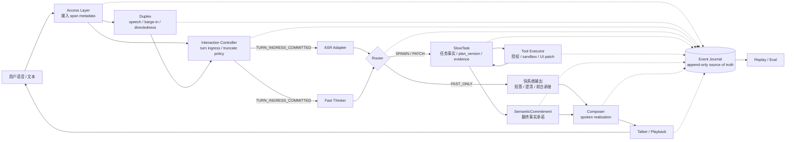
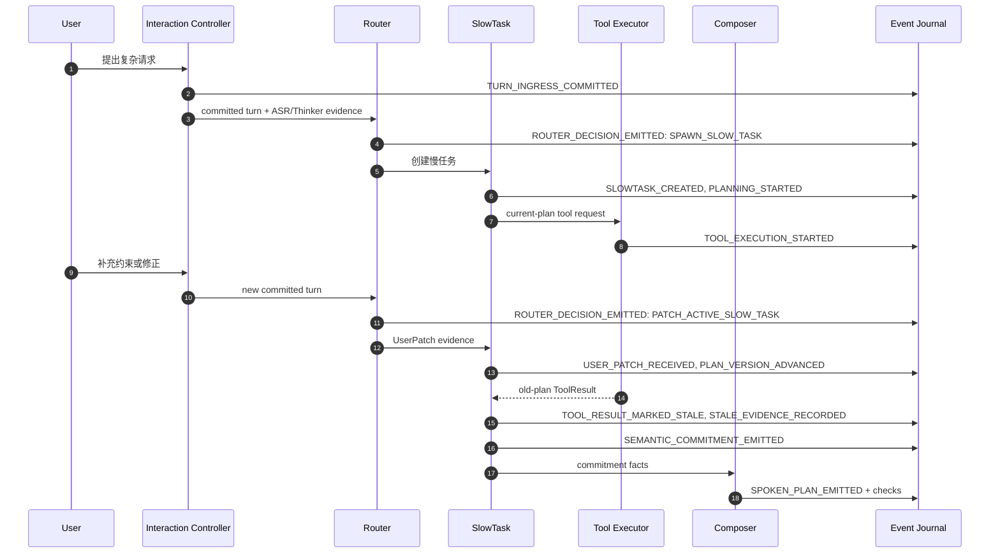
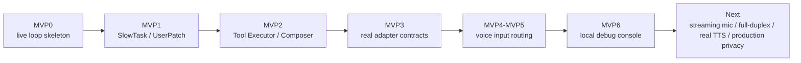

# 快慢双系统语音 Agent

> 实时接住用户，后台推进任务，并让每一次承诺都有据可查。


`voice-agent` 关注的不是“把语音接到大模型上”，而是实时语音 Agent 的控制面：当用户打断、补充约束、修改意图，或工具结果延迟返回时，系统仍然能够保持交互不断线、任务状态一致、执行边界清晰。

**核心判断：快系统负责响应，慢系统负责承诺。**

这份展示文档建议按 5 分钟阅读节奏理解：

1. 先看愿景：为什么语音 Agent 需要快慢双系统。
2. 再看架构：控制面如何拆分职责。
3. 最后看证据：仓库里哪些边界已经被 ADR、代码和 replay 固定下来。

## 1. 设计命题

传统语音助手常被组织成一条串行链路：

```text
Speech -> ASR -> LLM -> TTS
```

这条链路适合短问答，但很难支撑真实任务型语音交互：

- 用户可能在助手播报时插话，系统需要先处理实时交互时序。
- 用户可能在任务进行中继续补充约束，系统需要持续任务状态。
- 工具结果可能属于旧计划，系统需要判断它能否推进当前任务。
- 最终回答听起来可以自然，但事实来源必须可验证。

`voice-agent` 的目标是把语音助手从级联模型链路，升级为一个可追踪、可确认、可回放的实时任务控制面。

## 2. 系统总览


这张图里最重要的不是模块数量，而是职责所有权：

- **Duplex / Interaction Controller** 先处理实时输入、打断、截断和 turn commit。
- **Router** 只做快慢路径分流，不直接改写复杂任务事实。
- **SlowTask** 拥有复杂任务事实、计划版本、证据审查、确认状态和最终语义承诺。
- **Composer** 负责把事实说自然，但不能改写事实。
- **Event Journal** 是关键状态迁移的事实来源，支撑 replay、审计和评估。

<details>
<summary>查看 Mermaid 技术版架构图</summary>



</details>

## 3. 快慢双系统

快慢之分不是“小模型 vs 大模型”，而是两种不同责任边界。

| 系统 | 目标 | 典型职责 | 不应该做什么 |
| --- | --- | --- | --- |
| 快系统 | 低延迟、不中断、前台体验 | 打断处理、短回应、澄清、轻问答、Router 分流 | 不对复杂任务作最终事实承诺 |
| 慢系统 | 高后果、可验证、任务推进 | 计划、证据、工具、确认、stale result、SemanticCommitment | 不绕过授权边界直接执行动作 |

快系统让用户感到系统一直在线；慢系统保证真正的任务事实不被抢跑。两者之间由 Router 显式分流，而不是让模型文本隐式决定系统行为。

## 4. 任务如何流动


这条链路体现了项目最核心的状态观：

- 用户补充不是直接改任务，而是先进入 UserPatch evidence。
- 计划变化通过 `plan_version` 显式推进。
- 旧计划工具结果默认进入 stale evidence。
- 最终回答来自 SemanticCommitment，而不是 Composer 临场发挥。

<details>
<summary>查看事件时序版</summary>



</details>

## 5. 可信执行边界


一个能办事的语音 Agent，需要把“模型输出”转化成可治理的系统行为。

| 边界 | 设计要求 |
| --- | --- |
| Adapter boundary | ASR、Thinker、Slow LLM、TTS 等外部模型必须通过 adapter，并声明 capability matrix。 |
| Event Journal | 关键状态迁移必须写入 per-session append-only event journal。 |
| Plan binding | ToolCall、ToolResult、UserPatch、SemanticCommitment 必须绑定 `task_id`、`plan_version`、`task_event_seq`。 |
| Stale policy | 旧计划结果不得推进当前任务，除非 SlowTask 显式 adopt/rebase。 |
| Tool authorization | MVP 工具只能在 demo sandbox 执行，高风险动作必须经过确认和授权。 |
| Composer contract | Composer 只做表达融合，不得改写 immutable facts、tool status、risk warnings。 |
| Replay discipline | 默认 replay 不重跑真实模型、真实工具、网络、时钟或随机数。 |

这些边界让系统不仅“会说”，还知道自己什么时候不能说、不能做、不能把旧证据当成当前事实。

## 6. 当前工程证据

当前仓库已经落地的是一个 control-plane spine，而不是完整生产语音产品。它的价值在于：核心边界已经被 ADR、规格、代码、replay fixture 和测试共同固定下来。

| 方向 | 仓库证据 |
| --- | --- |
| 架构治理 | `stage_b_adr_register.md`、`docs/adr/` 下的 accepted ADR |
| 事件规范 | `docs/specs/event-registry.md`、`src/voice_agent/events/` |
| 确定性回放 | `docs/specs/replay-spec.md`、`src/voice_agent/replay/` |
| 快慢分流 | `src/voice_agent/router/router.py` |
| 慢任务状态 | `src/voice_agent/state/slowtask_state.py`、`src/voice_agent/slowtask/` |
| 工具边界 | `src/voice_agent/tools/executor.py`、demo sandbox policy |
| 表达与检查 | `src/voice_agent/composer/`、`src/voice_agent/checks/` |
| 本地语音调试 | `scripts/mvp6-debug-console`、MVP5/MVP6 runtime docs |

从项目结构上看，当前实现重点覆盖：

- MVP0 live loop skeleton：ingress、interrupt/truncate、mock understanding、playback、journal、replay。
- MVP1 SlowTask spine：UserPatch、`plan_version`、stale evidence、task-focus routing。
- MVP2 tool/composer boundary：demo Tool Executor、confirmation gate、truthfulness checks。
- MVP3-MVP6 adapter 与本地语音路由验证：provider-free / opt-in local wav / debug console。

## 7. 演进路线



下一阶段的关键不是扩大概念，而是在不破坏现有边界的前提下，把 mock / provider-free 路径逐步替换为真实 adapter、真实流式音频和更完整的工具执行闭环。

## 一句话总结

`voice-agent` 的核心是一个实时语音任务 Agent 控制面：快系统保持交互不断线，慢系统治理任务事实和执行承诺，Event Journal 让系统在事后仍然说得清每一步为什么发生。
