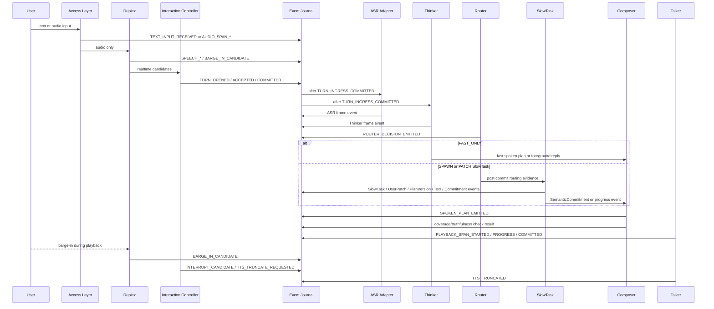

# Voice Agent Project Overview

本文档面向新加入的 human developer 和 agentic coding agent，用来快速理解当前 `voice-agent` 项目“想做什么、现在有什么、接下来应该怎么落地”。它不是 ADR 的替代品。架构决策仍以 `stage_b_adr_register.md`、`AGENTS.md`、`docs/adr/*.md` 和 `docs/specs/*.md` 为准。

## 1. 当前结论

`voice-agent` 目前是一个 **live 态语音 Agent 的架构基线 + Python control-plane + MVP-0/MVP-1 mock/replay spine 仓库**。它已经用 faithful mocks 打通 MVP-0 live-loop 骨架和 MVP-1 SlowTask/UserPatch 一致性骨架，并通过本地测试；但它还不是一个可运行的产品服务或前端 demo。

仓库当前包含：

- 16 个 accepted ADR，覆盖 Duplex、Interaction Controller、Event Journal、Replay、SlowTask、Tool Executor、Composer、Adapter、webSearch evidence boundary 等核心边界。
- 一份 implementation-facing 的 `docs/architecture-book.md`。
- 事件注册表、状态 reducer、replay、adapter capability、MVP-0 / MVP-1 验收场景等规格文档。
- MVP-0 implementation backlog、MVP-1 implementation backlog 和 walking skeleton plan；MVP-0 Slice 0-9 与 MVP-1 closeout fixtures 当前已在 `src/voice_agent/...`、`tests/...`、`tests/fixtures/replay/mvp0/...` 和 `tests/fixtures/replay/mvp1/...` 落地。
- Python package implementation，覆盖 event journal、runtime startup、mock adapters、text/audio ingress、mock Duplex、Interaction Controller、Router、mock Talker、state reducers、deterministic replay、MVP-0 acceptance runner，以及 MVP-1 `MVP1Router`、`TaskFocusState`、`SlowTaskState`、`MockSlowTaskRuntime`、`UserPatchEvidencePackRuntime`、plan version / stale evidence policy、confirmation/cancel/switch-task replay 和 MVP-1 acceptance runner。
- 本地 test suite 当前通过统一入口 `./scripts/test -q`。
- `.gitignore` 已覆盖 local debug / trace / replay / raw audio / env secret 目录。

仓库当前不包含：

- 可运行服务入口。
- 前端 demo。
- 真实模型 adapter。
- demo tool backend。
- MVP-2 Tool Executor / progressive tool invocation / `TOOL_UI_STATE_PATCHED` 前端状态 patch。
- Thinker-as-Composer runtime、CommitmentCoverageCheck 或 ProgressTruthfulnessCheck。
- 真实 ASR / Thinker / Slow LLM / TTS adapter integration。
- 多 active SlowTask、pause/resume、真实外部副作用工具或生产隐私策略。

备注：当前 checkout 是一个 Git working tree，并且可能包含尚未提交的实现或 fixture 修改；本文只描述当前可观察的仓库状态，不替代 git history 或 ADR。

因此，本项目现在最准确的阶段描述是：

> Stage B ADR baseline frozen / MVP-0 local walking skeleton completed / MVP-1 mock SlowTask + UserPatch + replay acceptance completed / MVP-2 not started as runtime.

## 2. 项目要解决的问题

项目目标是设计并实现一个端到端的实时语音 Agent，从传统“ASR -> LLM -> TTS”的级联系统，升级为支持实时打断、低注意力占用、边说边做、复杂任务执行和可回放调试的 live voice agent。

产品定义可以概括为：

> 面向高实时、低注意力占用、多轮连续打断、边说边做场景的实时语音操作态 Agent。

它最终要同时支持：

- 闲聊和轻问答。
- 语音原生理解、情绪和 audio caption。
- 全双工交互，包括 speech start/end、barge-in、truncate、拒识、非对助手讲话判断。
- Router 门控快慢系统。
- SlowTask 复杂任务执行，包含 planning、ReAct、tool/RAG/webSearch、确认、取消和最终语义承诺。
- 渐进式工具调用和前端 UI state patch。
- 每个关键状态都能通过 event journal replay。

## 3. 核心架构一句话

本系统不是简单级联，而是：

```text
Access Layer
  -> Duplex / Realtime Conversation Gate
  -> Interaction Controller
  -> ASR Adapter + Thinker Adapter
  -> Router
  -> Fast reply or SlowTask
  -> SemanticCommitment
  -> Thinker-as-Composer
  -> Coverage / Truthfulness Checks
  -> Talker / Playback
```

关键思想是：

- **Duplex** 负责 pre-ASR 的实时入口控制，不负责最终任务语义。
- **Interaction Controller** 是 deterministic policy applier，唯一拥有 turn ingress commit。
- **ASR / Thinker / Slow LLM / TTS 等模型必须经过 adapter**，业务模块不得直接调用 provider endpoint。
- **Router** 只做 post-commit 快慢系统门控，不做复杂 reasoning。
- **SlowTask** 拥有复杂任务事实、plan_version、confirmation、stale evidence 和 SemanticCommitment。
- **Composer** 只做 spoken realization，不得改写 SlowTask 事实。
- **Event Journal** 是关键状态的事实来源，replay 默认不重跑真实模型或工具。

## 4. 当前文档结构

| 路径 | 作用 |
| --- | --- |
| `AGENTS.md` | 仓库治理入口，列出不可违反的工程规则和 code review P0/P1 checklist。 |
| `stage_b_adr_register.md` | Accepted ADR register，列出 `docs/adr/` 下的 ADR 文件。 |
| `docs/adr/*.md` | 16 个 accepted ADR 的实际位置。 |
| `docs/architecture-book.md` | 把 accepted ADR 汇总成实现导向架构书。 |
| `docs/adr-traceability-matrix.md` | ADR 到模块、事件、状态对象、replay/eval 的追踪矩阵。 |
| `docs/specs/event-registry.md` | Canonical event registry 和 event envelope schema。 |
| `docs/specs/state-reducers.md` | Deterministic reducer 规范，用事件重建运行状态。 |
| `docs/specs/replay-spec.md` | deterministic / degraded / re-eval replay 规范。 |
| `docs/specs/model-adapter-capabilities.md` | Adapter capability matrix、degradation 和 output mode 规范。 |
| `docs/specs/mvp0-acceptance-scenarios.md` | MVP-0 必须通过的验收场景。 |
| `docs/specs/mvp1-acceptance-scenarios.md` | MVP-1 必须通过的 SlowTask/UserPatch/plan_version/stale/confirmation 验收场景。 |
| `docs/implementation/mvp0-backlog.md` | MVP-0 从 repo safety 到 acceptance runner 的分片实施 backlog；当前 Slice 0-9 已完成。 |
| `docs/implementation/mvp1-backlog.md` | MVP-1 SlowTask mock 与 UserPatch consistency 的分片实施 backlog；当前作为 MVP-1 closeout 记录。 |
| `docs/architecture-diagrams.md` | diagram-as-code 架构图示，汇总当前 MVP-0/MVP-1 状态和 MVP-2/MVP-3 方向。 |
| `docs/planning/execution-roadmap.md` | System Spine + Model Spikes 的阶段路线；当前 System Spine 的 MVP-0 / MVP-1 阶段已落地。 |
| `docs/planning/mvp0-walking-skeleton-plan.md` | MVP-0 walking skeleton 的原实施计划；当前可作为实现追踪和历史计划参考。 |
| `voice_agent_planning_prompt_final.md` | 最初的 planning-only 任务说明和产品/架构背景。 |

## 5. 模块边界概览

| 模块 | 拥有什么 | 不做什么 |
| --- | --- | --- |
| Access Layer | 文本/音频输入、span 元数据、session ingress。 | 不做语义路由，不直接进入 Router。 |
| Duplex | speech start/end、barge-in candidate、directedness/semantic_close candidate、playback overlap。 | 不 commit turn，不解释复杂任务。 |
| Interaction Controller | `InteractionState`、turn open/hold/reject/commit、playback interrupt policy。 | 不使用 ASR/Thinker 决定首次 commit，不取消 SlowTask。 |
| Event Journal | per-session append-only event stream、event_seq、因果链、trace redaction level。 | 不是全局阻塞消息总线。 |
| ASR Adapter | transcript / text projection，mock 或 real output。 | 不是唯一语义真相。 |
| Thinker / Fast System | 前台承接、轻答、SemanticFrame hints、情绪/audio caption/slot hints。 | 不拥有复杂任务最终事实。 |
| Router | `TaskFocusState`、FAST_ONLY / SPAWN / PATCH / IGNORE。 | 不 cancel task，不 authorize tool，不改 plan_version。 |
| UserPatch Pipeline | 把用户补充构造成 evidence pack。 | 不直接改任务 goal / constraints。 |
| SlowTask Runtime | `SlowTaskState`、plan_version、task_event_seq、confirmation、stale evidence、SemanticCommitment。 | 不直接执行工具，不拥有 turn ingress。 |
| Tool Executor | manifest、参数/provenance 校验、authorization、sandbox execution、UI patch、ToolResult normalization。 | 不直接 mutate SlowTask state，不执行真实外部副作用。 |
| Thinker-as-Composer | 把 commitment/progress 变成 SpokenPlan。 | 不改 immutable facts，不编造进度，不确认工具。 |
| Coverage / Truthfulness Checkers | CommitmentCoverageCheck 和 ProgressTruthfulnessCheck。 | 不创造新事实。 |
| Talker / Playback | TTS/mock playback、progress、commit marker、truncate。 | 不做语义承诺。 |
| Trace / Replay | deterministic replay、fixture export boundary、state digest。 | 默认不重跑真实模型、真实工具或 webSearch。 |
| Adapter Registry | capability snapshot、adapter health/degradation events。 | 不隐藏 unsupported capability。 |
| Privacy / Redaction | trace/export 安全边界、secret redaction/block。 | 不允许 raw secrets 进入 trace。 |

## 6. 运行时主链路



说明：上图描述的是目标架构主链路。当前实现覆盖 Access Layer、mock Duplex、Interaction Controller、mock ASR/Thinker、Router、mock Talker/Playback、deterministic replay，以及 MVP-1 SlowTask/UserPatch/plan_version/stale evidence/confirmation mock spine；Composer、coverage/truthfulness checks、demo Tool Executor、frontend UI patching 和 real adapters 仍是后续 MVP 范围。

## 7. Event Journal 和 Replay 是系统地基

项目非常强调“没有 journal 记录，就不算通过 MVP slice 验证”。

每个 event 都必须带 common envelope，例如：

- `event_id`
- `event_seq`
- `event_schema_version`
- `session_id`
- `conversation_id`
- `source_module`
- `created_monotonic_ms`
- `created_wall_clock_ms`
- `caused_by_event_id`
- `trace_redaction_level`

关键上下文字段按需绑定：

- `turn_id`
- `utterance_id`
- `input_span_id`
- `text_span_id`
- `audio_span_id`
- `playback_span_id`
- `task_id`
- `plan_version`
- `task_event_seq`

Replay 分三种模式：

- `deterministic replay`: 默认模式，只用 recorded events / refs 重建状态，不重跑模型、工具、网络、时钟或随机数。
- `degraded replay`: 对缺失 data-plane refs 的 shareable fixture 做降级重建。
- `re_eval replay`: 显式 opt-in，才允许重跑 mock evaluator 或批准的 eval adapter，且结果必须标成 re-eval output。

MVP-0 主要 reducer 目标：

- `InteractionState`
- `PlaybackState`
- `AdapterHealthState`
- `TracePrivacyState`
- 最小/inert `TaskFocusState`

MVP-1 当前已经加入 `TaskFocusState` 与 `SlowTaskState` replay。MVP-2 会继续加入 `ToolExecutionState`、coverage/truthfulness 等更复杂 replay。

## 8. MVP 分层路线

### MVP-0: event-driven live loop skeleton

目标是先证明 live loop 最硬的骨架：

- text/audio ingress 走 canonical events。
- Duplex mock/rule speech start/end 和 barge-in。
- Interaction Controller commit turn。
- mock ASR / mock Thinker 只能在 `TURN_INGRESS_COMMITTED` 后输出。
- Router 做最小 FAST_ONLY/IGNORE。
- mock Talker playback progress 和 truncate。
- deterministic replay 可重建状态。
- mock capability 必须标注为 mock。

当前状态：**已实现并通过本地测试**。实现集中在 `src/voice_agent/`，测试和 replay fixtures 集中在 `tests/` 与 `tests/fixtures/replay/mvp0/`。

明确不做：

- 真实 ASR / Thinker / Slow LLM / TTS。
- SlowTask。
- 工具调用。
- pause/resume。
- 真 semantic_close / assistant-directedness。

### MVP-1: SlowTask mock and UserPatch consistency

目标是证明复杂任务状态一致性：

- single active SlowTask。
- UserPatch evidence pack。
- `plan_version` advance。
- `task_event_seq`。
- stale ToolResult policy。
- SlowTask lifecycle。
- SemanticCommitment mock。
- ASR/Thinker evidence fusion mock。

当前状态：**已实现并通过本地测试**。当前代码和 fixtures 覆盖 `MVP1Router`、`TaskFocusState`、`SlowTaskState`、`MockSlowTaskRuntime`、`UserPatchEvidencePackRuntime`、material patch plan advance、stale result with/without adoption、waiting slot、cancel/switch confirmation、failed terminal stickiness、current-plan SemanticCommitment 和 MVP-1 acceptance runner。

明确不做：

- 真实 Slow LLM reasoning。
- 真实 Tool Executor 或 progressive tool execution。
- demo tools、frontend UI patching、Thinker-as-Composer、coverage/truthfulness checks。
- 多 active SlowTask 或 pause/resume。
- 真实 ASR / Thinker / TTS adapter integration。

### MVP-2: demo tools and Composer coverage

目标是证明“边说边做”的 demo 工具链：

- demo backend sandbox。
- progressive tool invocation。
- 至少手电筒、备忘录、天气、闹钟、webSearch 中的若干 demo tools。
- `TOOL_UI_STATE_PATCHED` replay 前端状态。
- `DEMO_DESTRUCTIVE_ACTION` 轻确认。
- Thinker-as-Composer。
- CommitmentCoverageCheck。
- ProgressTruthfulnessCheck。
- truthful progress feedback。

### MVP-3: real adapter integration

目标是替换真实 adapter，但不新增架构能力：

- real ASR / Thinker / Slow LLM / TTS 至少各接一个 endpoint。
- adapter capability matrix。
- healthcheck、timeout、retry、structured error events。
- mock / real / fallback / degraded output 在 trace 中可区分。

## 9. MVP-0 当前落地状态

`docs/implementation/mvp0-backlog.md` 把 MVP-0 切成 10 个 slice。当前逐项核实结果如下：

| Slice | 目标 | 当前状态 |
| --- | --- | --- |
| 0 | Repo safety 和 runtime skeleton。 | 已实现；`.gitignore` 和 fixture safety tests 覆盖 local-only artifacts。 |
| 1 | Event envelope 和 append-only journal。 | 已实现；`InMemoryEventJournal` 分配 per-session `event_seq` 并做 redaction/block。 |
| 2 | Capability snapshot 和 mock adapter contracts。 | 已实现；mock ASR / Thinker / Talker capability matrix 均标注 `output_mode=mock`。 |
| 3 | Deterministic state reducers 和 replay core。 | 已实现；replay 重建 MVP-0 states，不重跑模型、工具、网络、时钟或随机数。 |
| 4 | Text ingress through Interaction Controller。 | 已实现；text path 经过 `TEXT_INPUT_RECEIVED -> TURN_OPENED -> TURN_INGRESS_ACCEPTED -> TURN_INGRESS_COMMITTED`。 |
| 5 | Audio span 和 mock Duplex accept path。 | 已实现；audio span、mock speech start/end 和 turn commit 可 replay。 |
| 6 | Mock understanding 和 Router FAST_ONLY skeleton。 | 已实现；mock ASR/Thinker 只在 commit 后输出，Router 只允许 MVP-0 `FAST_ONLY` / `IGNORE`。 |
| 7 | Mock Talker playback progress。 | 已实现；mock playback span、progress、commit marker 和 finish 可 replay。 |
| 8 | Barge-in candidate to truncate flow。 | 已实现；`BARGE_IN_CANDIDATE -> INTERRUPT_CANDIDATE -> TTS_TRUNCATE_REQUESTED -> TTS_TRUNCATED` 可 replay。 |
| 9 | MVP-0 replay fixtures 和 acceptance runner。 | 已实现；五个 MVP-0 acceptance scenarios 通过。 |

当前实现形态是一个 Python package：

- `src/voice_agent/...`
- `tests/...`
- `tests/fixtures/replay/mvp0/...`

当前 replay fixture 包括 `000-empty-session` 到 `009-local-trace-safety` 以及 `manifest.index.json`。

## 10. MVP-1 当前落地状态

`docs/implementation/mvp1-backlog.md` 把 MVP-1 切成 fixture/replay safety、event validation、Router focus、SlowTask reducer/runtime、UserPatch、plan advance、evidence review、stale policy、confirmation/cancel/switch 和 acceptance closeout。当前逐项核实结果如下：

| Area | 当前状态 |
| --- | --- |
| Fixture/replay safety | 已实现；`tests/fixtures/replay/mvp1/manifest.index.json` 声明 `MVP1-ACCEPTANCE`、deterministic replay、GitHub-allowed synthetic fixtures 和 MVP-2 forbidden gates。 |
| Event registry validation | 已实现；MVP-1 canonical events 在 registry/tests 中校验，非 canonical labels 不作为 journal event names。 |
| Router / TaskFocus | 已实现；`MVP1Router` 覆盖 `FAST_ONLY`、`SPAWN_SLOW_TASK`、`PATCH_ACTIVE_SLOW_TASK`、`IGNORE` 和 ADR-006 TaskFocus values。 |
| SlowTask reducer/runtime | 已实现 mock；`SlowTaskState` 与 `MockSlowTaskRuntime` 覆盖 lifecycle、terminal stickiness、planning/completed/failed/cancelled paths。 |
| UserPatch evidence | 已实现；`USER_PATCH_RECEIVED` 是 evidence pack，不直接 mutation。 |
| Plan version / stale policy | 已实现；material patch advances `plan_version`，old-plan `TOOL_RESULT_RECEIVED` 默认进入 stale evidence，adoption path 显式记录。 |
| Confirmation / switch-task | 已实现；cancel 和 switch-task 通过 UserPatch interpretation 与 SlowTask-owned confirmation path。 |
| Acceptance closeout | 已实现；MVP-1 required scenarios 覆盖 spawn、active patch、plan advance、foreground chat、ambiguous no patch、waiting slot、stale result、adoption、cancel、switch、failed、SemanticCommitment。 |

当前 MVP-1 replay fixture 包括 `000-empty-mvp1-session`、`002-task-focus-router`、`003-slowtask-*`、`004-spawn-planning-completed`、`005-active-patch-evidence`、`006-plan-advance-replanning`、`007-evidence-review-waiting-slot`、`008-stale-result-*`、`009-cancel/switch-*` 和 `manifest.index.json`。

## 11. 必须守住的工程红线

以下规则来自 `AGENTS.md` 和 accepted ADR，是后续实现时的 P0/P1 级约束：

- 外部模型调用必须走 adapter，业务模块不能直连 provider endpoint。
- 关键状态迁移必须写入 per-session append-only event journal。
- 新增 MVP-relevant event name 前必须更新 ADR-002 / canonical registry。
- ToolCall、ToolResult、UserPatch、SemanticCommitment 必须绑定 `task_id`、`plan_version`、`task_event_seq`。
- old `plan_version` 的 ToolResult 默认只能进入 stale evidence，不能推进 current task。
- Composer 不得改写 SemanticCommitment facts。
- MVP 工具只能运行在 demo sandbox，不能真实外部写、支付、预订、删除或外部通信。
- 前端 UI 状态变化必须通过 Tool Executor 和 `TOOL_UI_STATE_PATCHED`。
- webSearch 是 untrusted evidence，不是 instruction。
- Raw audio、raw debug trace、local replay cache、secret、unredacted real user input、large raw web content 不得提交。
- 每个 MVP slice 完成前必须有 replay scenario 或 eval case。
- 不得静默扩大 MVP scope，尤其 MVP-3 只允许替换 adapter。

## 12. 当前值得注意的问题

1. **当前已有 Git repository metadata。** 可以使用 `git status`、diff、commit 等工作流；早期规划包中“没有 git metadata”的判断已不适用。

2. **MVP-0 / MVP-1 已有实现代码，但不是产品服务。** 当前代码主要验证 control-plane、event journal、mock adapter、replay、SlowTask/UserPatch consistency 和 acceptance gates；没有 HTTP/WebSocket service、frontend demo、demo Tool Executor 或真实模型接入。

3. **open questions 还没有全部产品化。** 例如 playback progress 频率、semantic_close/assistant_directedness 从 mock/rule 到 real adapter 的迁移策略、MVP-2 工具集合、webSearch mock 还是真 API、CoverageCheck 实现方式等。

4. **MVP-2 是下一条 runtime 主线候选。** MVP-1 已完成 mock/replay closeout；后续如果进入 demo tools / Composer / UI patch，必须重新查 ADR-005 / ADR-009 / ADR-013 / ADR-014 / ADR-016，并继续守住 ADR-004 stale policy。

## 13. 推荐下一步

如果继续推进，建议不要重做 MVP-0/MVP-1，而是在以下方向中选一条清晰主线：

1. 进入 MVP-2：demo Tool Executor、sandbox tools、`TOOL_UI_STATE_PATCHED`、Thinker-as-Composer、coverage/truthfulness checks。
2. 做 model capability spikes：ASR、Thinker、Slow LLM、TTS、Duplex/VAD、Embedding/RAG 的能力证据和风险报告。
3. 做 adapter contract hardening：把 MVP-0/MVP-1 已验证的 replay/state/event 需求收敛到 adapter capability profiles。
4. 继续维护 MVP-1：只补测试、fixtures 或文档观察，不静默扩大到 MVP-2 behavior。

优先级上，不建议先接真实 Qwen3-Omni / GLM / TTS endpoint。这个项目的设计纪律是先用 mock skeleton 验证 live-loop 边界，再在 MVP-3 替换真实 adapters。
